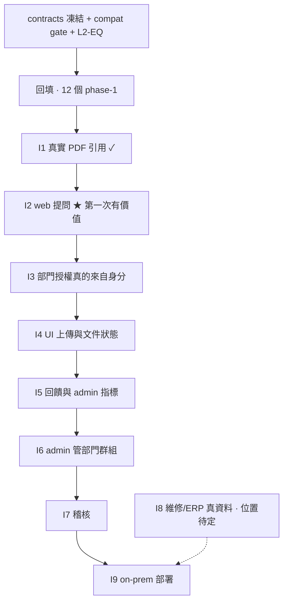

# Roadmap(ADR 0008 之後)

一個回填(phase-1 = Wave 0)+ 九個整合點。回填內部順序自由;I2–I9 嚴格依序,不可跳。
每個整合點通過時,系統都是「一個人做得到某件事」的完整可用狀態。
策略說明見 ADR 0008 §2,整合點的 Gherkin 在 `docs/integration/`。

## 現況

| 欄位 | 值 |
|---|---|
| 目前階段 | I2 · web 提問(I1 已通過 2026-09-03)。**I2 五塊已完成 3 塊**:`06-retrieval/phase-2`(09-04)、`07-generation/phase-2`、`05-ingestion/phase-2`(09-05)。剩 `03-conversation/phase-2`(gate 已全滿足,可派)與 `11-app-shell/phase-2` |
| 回填進度 | **9 / 12 資料夾的 phase-1 已 `done`**(01、02、03、04、05、06、07、09、12——每一個都由另一個 session 依 §5.1 獨立驗收,反向驗證的失敗訊息原文都進了 FEATURE.md 或 commit body)。剩下 3 個(08、10、11)**自動那半全綠且各自做過對著決定性量的反向驗證,卡在 `@manual`／`@e2e` 人工確認**——`/phase-done` 四項核心第二項,§5.4 說任何檢查都構不到「有人看過並接受」。合併成 `DECISIONS_NEEDED` #17 一列,附跑法與場景原文。`accept:phase1` 136 場景全過、`accept:coverage` 12/12 PASS、`gherkin:dup` PASS、`contract-gate` PASS。 |
| 契約版本 | `contracts/openapi/*.yaml` 七份,凍結;變更走 `/decide` + 使用者 |
| 舊 story | 253 approved 封存於 `archive/stories/PROGRESS.md`(唯讀歷史);對照表 `docs/architecture/story-to-capability-map.md` |
| 最後更新 | 2026-09-04(autopilot 第 1 輪) |

## 全貌

---

## 回填 · 12 個 phase-1

**前提**:`features/` scaffold(cucumber、`_world.ts`、`common.steps.ts`、`standalone.json`)已就位。

**規則**:phase-1 的每個場景綁到既有測試的入口;綁不到的寫進 phase-2。每個資料夾至少一個場景
做過反向驗證(改壞 → 紅)。回填不重驗 253 個 story 的細節,只證明「能力現在會做的事」有機器證據。

| Phase | 交付 | 狀態 | 參考 |
|---|---|---|---|
| 06-retrieval/phase-1 | 授權檢索、Deny-Wins、洩漏偵測、offsets、身分守門、MMR | done 2026-09-03 | **參考實作**,其他資料夾照它的形狀 |
| 05-ingestion/phase-1 | PDF 抽取(offsets、golden hash、空檔／加密拒絕)、chunk、embed、store、重匯拒絕 | **done 2026-09-04** | 反向驗證紅在切出的原文字串 |
| 07-generation/phase-1 | context 組裝、引用回填、捏造引用拒絕、空 context 短路 | **done 2026-09-04** | 紅在洩漏的 scopeKey 實際值 |
| 04-model-gateway/phase-1 | embed/generate in-process 主路徑、兩條薄路由、契約驗證、fidelity 守門、ASR | **done 2026-09-04** | |
| 01-identity/phase-1 | 登入、session cookie、sandbox seeder、CSRF | **done 2026-09-04** | |
| 03-conversation/phase-1 | 對話 CRUD、訊息、修訂、SSE change events、resync | **done 2026-09-04** | |
| 09-feedback-analytics/phase-1 | OK/NG、reason enum、usage events、admin 指標聚合、403 | **done 2026-09-04** | |
| 10-admin-console/phase-1 | admin 頁面(部門、群組、connector、health)`@e2e` | 自動全綠,**卡 `@e2e`** | DECISIONS_NEEDED #17 |
| 11-app-shell/phase-1 | 導覽、首頁、M3、跨視窗同步 `@e2e` | 自動全綠,**卡 `@e2e`** | DECISIONS_NEEDED #17 |
| 08-knowledge-management/phase-1 | 知識庫頁面(目前對 mock)`@e2e`,標明 mock | 自動全綠,**卡 `@e2e`** | DECISIONS_NEEDED #17 |
| 02-authorization/phase-1 | 空殼單獨跑起來(`services/identity` 薄切片能產出 scope 的證明) | **done 2026-09-04** | E04-S009 已由 ADR 0013 #7 解除 |
| 12-audit-observability/phase-1 | 空殼單獨跑起來(`services/audit` 0 行)+ health 路由 | **done 2026-09-04** | 紅在洩漏的子系統清單 |

**回填完成定義**:12 個 phase-1 全 `done`,`pnpm accept:phase1` 全綠,`pnpm gherkin:dup` PASS。

**2026-09-04 現況**:後兩項**已滿足**(136/136、無重複)。第一項差 08、10、11——它們的機器證據
全綠,差的是使用者親眼走一次 UI(`DECISIONS_NEEDED` #17)。這**不擋 I2**:I2 的五塊沒有一塊
依賴那三條人工場景。

---

## I1 · 真實 PDF 引用 ✓ 2026-09-03

**你做得到什麼**:一份真實中文 PDF 進去,檢索命中的引用能 `slice` 回原文逐字相等;
同一份文件在兩個部門下各自只對自己可見。

**驗收**:[i1-real-pdf-citation.feature](integration/i1-real-pdf-citation.feature) —
`@e2e @manual` 由使用者 2026-09-03 確認「對,就是那段」;其餘 5 個自動場景綠;反向驗證:
offset +1 → 紅在「切出的原文與引用文字不同」。

---

## I2 · web 提問 ★

**你做得到什麼**:在 apps/web 登入、問一個關於已索引文件的問題、讀到經 model gateway 產生的答案、
點引用打開偏移量指向的原文段落。模型可仍是假的(PF1),答案是 canned;證明的是體驗層到資料層
的接縫存在且對 scope fail-closed。

| 需要的 phase | 說明 |
|---|---|
| 06-retrieval/phase-2 | ~~接進 apps/api composition root~~ **done 2026-09-04** |
| 07-generation/phase-2 | ~~`answer()` 從 app.retrieval 拿 hits,回填引用~~ **done 2026-09-05**(`app.rag.ask()`) |
| 03-conversation/phase-2 | 送訊息 → RAG 回答 → 訊息帶 citations(契約 conversations.yaml 已有欄位?待 `/feature` 分流確認) |
| 11-app-shell/phase-2 | 引用可點、開原文段落面板 |
| 05-ingestion/phase-2 | ~~一條「把 fixture PDF 索引進 dev DB」的指令~~ **done 2026-09-05**(ADR 0015) |

**已知限制(要進 ADR)**:`02-authorization` 未落地前,scope 由 demo 使用者的 session 固定給 `dept:eng`。

**驗收**:[i2-ask-in-web.feature](integration/i2-ask-in-web.feature)

**通過後立刻做**:使用者拿自己的一份真實文件問三個問題,把「答非所問」的紀錄下來——那是 E04-S037
(真模型)的第一份需求,比繼續寫程式重要。

**通過後也要做(守門升版,寫在這裡免得靠記憶)**:目前守門停在 template **v1.2.2**
(`features/scripts/`,採用於 2026-09-04)。

**升版目標:v1.3.4(tag `template/v1.3.4`)。** ※ 2026-09-04 更新:本段原本寫 v1.3.2,
技術顧問 ai-km-3a 同日回報模板已收工在 1.3.4,目標改為它。v1.3.2(7eecc51)仍是
**第一個 `--check` 能進 CI 的版本**(檔頭 sha256 自比對,不需要模板 checkout),
並修掉 1.2.2 的六個問題——其中兩個在 1.2.2 上**是死的**:
`features/scripts/gates.config.json` 讀不到(cucumber cwd 靠自動偵測)、
`verify-against.sh` 會把 exit 127 報成通過。1.3.4 在其上再加:

| 1.3.4 帶來的 | 對我們的意義 |
|---|---|
| 設定檔搜尋順序:`env GATES_CONFIG_DIR` > 腳本自身目錄 > `ROOT/scripts` | 這條就是修掉「`gates.config.json` 讀不到」那個死問題的機制;`GATES_CONFIG_DIR` 讓 worktree／CI 各自指路,不再靠 cucumber 的 cwd 自動偵測 |
| `verify-against` 的 exit 127 修復 + 標記行 | §5.3 的同一個教訓:命令不存在被報成通過,是「從讀推斷」在腳本裡的形態 |
| `--check` 的 sha256 可進 CI | 守門自己被改掉時會被抓到 |
| `sync` 的語言選集與 `--prune` | 只同步我們用得到的,不吃整包 |
| `gherkin-dup` allowlist(**要填 reason**) | 逐字重複偶爾是對的(例如兩個能力真的共用一句),但必須寫明理由才准豁免——形式可以被鑽,理由不行 |
| `coverage --run` 只跑 `done`/`in-progress` + `runTimeoutMs` | 正是下一段本來就寫的那條:`todo` 的 phase 刻意是紅的,對它要求 `--run` 通過是構造上就錯的。1.3.4 把它變成模板的機制,不再是我們自己記得 |

I2 通過那一輪的升版程序(不變):逐支 diff 確認「新版 ⊇ 我們」→ sync(**舊的 SOURCE 標頭要
重跑一次 sync 才會過 `--check`,一次性過渡**)→ `verify-against`(這版才可信)→ `--check`
進 CI **先照印一輪再 gate** → coverage 可以開 `--run`(**只跑 done/in-progress 的 phase**——
`todo` 的 phase 刻意是紅的,對它要求 `--run` 通過是構造上就錯的——1.3.4 起這條由模板自己保證)。

**聯合 retro(顧問提議,已接受)**:`AI_KM` 通過 I2、或 09-07 到期,**先到者**觸發,
由模板作者主持。我們這邊的輸入是 `docs/PITFALLS.md` 的「尚未寫進規則檔」那一節
——那些是踩出來但還沒變成機械守門的坑,正好是模板該不該長出新檢查的原始材料。

---

## I3 · 部門授權真的來自身分

**你做得到什麼**:兩個部門的人問同一題,各自只看到自己部門的文件;管理員把人換部門後立刻生效。

| 需要的 phase | 說明 |
|---|---|
| 02-authorization/phase-2 | 從 identity 的 session 產出 `RetrievalScope`(E04-S009 解除 blocked) |
| 06-retrieval/phase-2 的暫時限制移除 | 固定 `dept:eng` 拿掉 |
| 01-identity/phase-2 | 使用者的部門／群組落庫 |

**驗收**:`docs/integration/i3-*.feature`(待 `/feature` 建立)

---

## I4 · UI 上傳與文件狀態

**你做得到什麼**:從 UI 上傳一份文件,看到它排隊／處理中／可問;壞檔(掃描檔、加密)會說原因。

| 需要的 phase | 說明 |
|---|---|
| 08-knowledge-management/phase-2 | 上傳、狀態列表接真 API |
| 05-ingestion/phase-3 | async、`apps/worker-ingestion`(目前 0 行)、失敗原因落庫 |
| 06-retrieval/phase-3 | sqlite-vec 成為預設持久 store |
| 12-audit-observability/phase-2 | 文件狀態事件進稽核 |

---

## I5 · 回饋與 admin 指標

**你做得到什麼**:對答案按 OK/NG 並選原因;管理員在 admin 看到真實聚合(不是 mock)。

| 需要的 phase | 說明 |
|---|---|
| 09-feedback-analytics/phase-2 | 接真 RAG 回答的 feedback;reason code → 繁中標籤(~~今天發現 admin 原樣渲染 `INCORRECT`~~ —— 2026-09-04 回填時實跑確認**此缺陷已不存在**:`packages/api-client/src/feedback-reason.ts` 的 `getFeedbackReasonLabel` 已由 admin 清單與詳情兩個元件呼叫,`INCORRECT` → 「答案不正確」,未知碼原樣輸出。是紀錄落後,不是新修的實作) |

---

## I6 · admin 管部門與群組

**你做得到什麼**:管理員在 admin 建部門、把人加進群組,I3 的可見性立刻反映。

| 需要的 phase | 說明 |
|---|---|
| 10-admin-console/phase-2 | 部門／群組頁接真 API |
| 02-authorization/phase-3 | 群組 → scopeKeys 的對應與變更即時生效 |

---

## I7 · 稽核

**你做得到什麼**:誰在何時問了什麼、看到哪些文件、答案引用了什麼,可查可匯出;未授權的資料不進 log。

| 需要的 phase | 說明 |
|---|---|
| 12-audit-observability/phase-3 | `services/audit` 從 0 行到可查 |

---

## I8 · 維修助理與 ERP 報表(位置待定)

**你做得到什麼**:E07／E09 的體驗跑在真資料上,或明確標為 mock 展示。**後端來源待使用者定義**;
定義前不建 `13-maintenance-assistant`、`14-erp-reporting` 資料夾。

**開資料夾那天的第一件事(2026-09-05,由 `check-boundaries` 第一次真的跑起來時發現)**:
`08-knowledge-management` 的 `apps/web/src/lib/knowledge-candidates.ts`(E07-S023,
「把一個維修診斷 session 提交為知識庫候選」)**已經 import 了 `maintenance-cases.ts`**
——也就是說 **08 與這個還沒建的 domain 已經在相當深的層次接觸了**,不是未來式。

那條邊目前記在 `scripts/boundaries.allow.json`(`08-knowledge-management → i8-pending`)。
**I8 開資料夾時第一件事是決定它要變成契約還是搬家**,不是把 allow 邊改個擁有者名字就算數。
在那之前 `erp-*`、`diagnostic-*`、`maintenance-cases`、`equipment`、`error-codes` 的擁有者
是佔位名 `i8-pending`——改名就是 owners 表的一次 diff,不用搬檔案。

---

## I9 · on-prem 部署

**你做得到什麼**:一台機器 `docker compose up`,I2～I7 全部做得到。E01-S028 的 image 接真服務。

---

## 未排程

`/feature` 新增但還沒歸進任何整合點的。`/sprint` 時決定要不要拉進來。

| 能力 | 加入日期 | 建議位置 | 備註 |
|---|---|---|---|
| E04-S037 真模型 provider(PF3) | 2026-09-03 | I2 之後、I3 之前或並行 | 使用者裁 embedding 模型(d11) |
| 契約收緊第四條:analytics.yaml querystring default | 2026-09-03 | 隨時 | 待使用者一個字 |

## 節奏

- 1 週一個 sprint,2–4 個 phase,WIP ≤ 2
- 回填約 2 sprint(可與 I2 的 phase-2 並行:回填不改實作)
- I2 約 2 sprint;之後每個整合點 1–2 sprint
- 估計不是承諾。超過兩倍是資訊(範圍錯、依賴沒浮出、分級分錯),在 retro 記一筆
