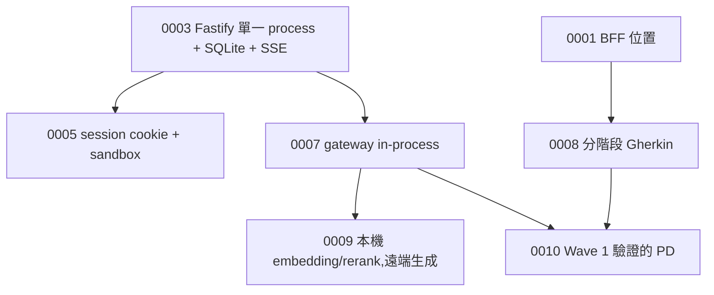

# 02 · Decision Map

所有有取捨的決定,ADR 格式,**只增不刪**。被推翻的標 `Superseded`,不刪——決策地圖的價值在於看得到
「當初為什麼這樣想、後來為什麼改」。新增用 `/decide`;硬約定(契約放寬、新 endpoint、新資料夾、付費／外部服務、
真模型)要使用者拍板才能 Accepted。

## 怎麼讀

- **Status**:`Accepted` 生效 / `Superseded by ADR NNNN` 被推翻 / `Proposed` 待使用者
- 每份 ADR:Context · Decision · Alternatives · Consequences · Related
- `docs/00-design.md` 凍結;它與現況的差異全在下方「已知不同之處」

## 索引

| ADR | 標題 | Status | 一句話 |
|---|---|---|---|
| [0001](adr/0001-team-a-bff-location.md) | Team A BFF 位置 | Accepted | BFF 邏輯放 `apps/web/src/app/api/*` Route Handlers,不繞過 domain service |
| [0002](adr/0002-frontend-unit-test-runtime.md) | 前端單元測試 runtime | Accepted | Vitest + jsdom + Testing Library |
| [0003](adr/0003-api-runtime-sqlite-sse.md) | API runtime | Proposed(使用者 2026-08-28 拍板方向) | Fastify 5 單一 process、`/v1`、SQLite、SSE;domain 碼在 `services/<domain>` 各匯出 plugin |
| [0004](adr/0004-asr-runtime-whisper-cpp.md) | ASR runtime | Proposed(使用者拍板) | whisper.cpp `whisper-server` sidecar |
| [0005](adr/0005-session-cookie-auth-and-test-sandbox.md) | Session cookie auth + test sandbox | Proposed(使用者拍板) | `auth.yaml` 三條路由、session cookie、E2E sandbox seeder |
| [0006](adr/0006-material-3-token-first-ui.md) | Material 3 token-first UI | Proposed(使用者要求) | M3 design token 重建 globals.css |
| [0007](adr/0007-model-gateway-in-process-primary-path.md) | Model Gateway in-process 主路徑 | Proposed(使用者 2026-09-02 拍板) | `createModelGateway()` 是主路徑,HTTP 是薄包裝;會 decorate 的 plugin 一律 `fp()` + 真實 `register()` 測試 |
| [0008](adr/0008-staged-gherkin-development-paradigm.md) | 分階段 Gherkin 取代 epic-story | Proposed(四點採建議預設;2026-09-04 切換已發生) | 12 個能力資料夾、phase Gherkin、整合點 I1–I9、五個指令、owner 制 |
| [0009](adr/0009-local-embedding-rerank-remote-generation.md) | 本機 embedding／rerank,遠端生成 | 第一批 D2/D3/D4 Accepted 2026-09-04 | bge-m3 本機、cross-encoder 重排、生成走使用者 gateway(D1 延後) |
| [0010](adr/0010-wave1-verified-product-decisions.md) | Wave 1 驗證過的產品決策升為 Accepted | Accepted 2026-09-04 | PD-06/07/08/09/10/11/15/28/36 |

## 已知不同之處(`00-design.md` 凍結後的偏離,只增不刪)

| 日期 | 原始規格 | 現在 | 記錄 |
|---|---|---|---|
| 2026-09-02 | PD-28「Model 呼叫必須經過 Model Gateway」讀成網路跳點 | in-process 主路徑,HTTP 是薄包裝 | ADR 0007 |
| 2026-09-03 | 14 個 epic、atomic story、Team A／B 分工(PD-34、PD-35) | 12 個能力資料夾、phase Gherkin、FEATURE.md owner 制 | ADR 0008 |
| 2026-09-04 | 規格庫是規格 | 規格庫是背景(`archive/`,tag `baseline-bmad`);`.feature` 是規格 | ADR 0008 §3、`archive/README.md` |
| 2026-09-04 | §35 RAG Evaluation Policy、§43 MVP 驗收指標 | 原檔在 §25 截斷,兩節不存在;需要時從零定義 | `archive/README.md` |
| 2026-09-04 | PD-29 外部 Cloud LLM 預設關閉 | 細化:生成走使用者自己的 gateway,embedding／rerank 本機 | ADR 0009 |
| 2026-09-04 | PD-06～11、15、28、36 為「暫定」 | 升為 Accepted(Wave 1 真跑驗證) | ADR 0010 |

## PD → ADR 對照(`00-design.md` §6 升級登記處)

| PD | ADR | 日期 | 方式 |
|---|---|---|---|
| PD-03 | 0005 | 2026-08-28 | 細化(MVP 先 session cookie) |
| PD-06、07、08、09、10、11、15、28、36 | 0010 | 2026-09-04 | 驗證升級 |
| PD-11、28 | 0007 | 2026-09-02 | 形狀 |
| PD-29 | 0009 | 2026-09-04 | 細化 |
| PD-34、35 | 0008 | 2026-09-03 | 推翻 |
| PD-37 | 0001 | 2026-08 | 落實 |
| PD-39 | 0008 | 2026-09-03 | 落實為 owner 制 |

## 待決

在 `DECISIONS_NEEDED.md`,不在這裡重複。Proposed 狀態的 ADR 也是待決的一種:0003–0008 是使用者口頭拍板
但未在檔案上改 Status——**升級規則**:下一次任何一份被引用為 gate 時,協調者請使用者一句話把它改 Accepted。

## 依賴圖

