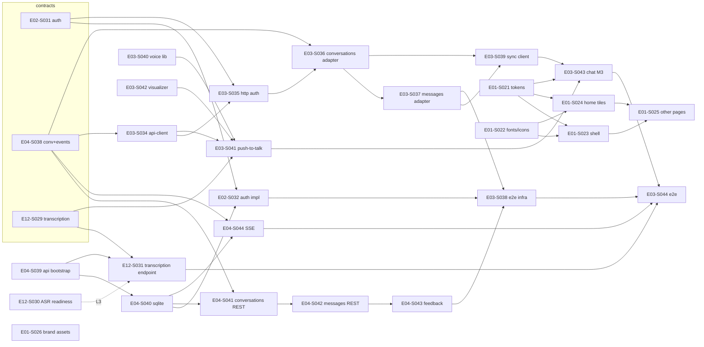

# 語音輸入／對話持久化／跨視窗同步／Material 3 —— 架構與平行開發計畫

- 日期：2026-08-28
- 來源：使用者指示（本批 29 個 story 直接插入規格庫對應 epic 檔，比照
  E04-S037 先例；規格權威仍是 epic 檔，本文只做導讀與排程）
- 相關 ADR：0003（API runtime／SQLite／SSE）、0004（ASR）、0005（session
  cookie／test sandbox）、0006（M3 token-first／素材）

## 1. 使用者已拍板的決策

| 題目 | 決策 |
|---|---|
| ASR 執行位置 | 伺服器端 whisper（whisper.cpp `whisper-server` sidecar）；開發機 GTX 1650、部署機 RTX 4070；中英文混合 |
| 語音互動 | push-to-talk + 辨識完成自動送出；先不做 TTS、不做即時字幕 |
| 部署 | 有 HTTPS（`getUserMedia` 前提） |
| 持久化 | 真後端：`apps/api` + SQLite（better-sqlite3）+ SSE 推播；即使單機部署也保留跨裝置能力 |
| 同步程度 | 另一視窗看到新對話／新訊息／改名／封存／刪除即可；生成中串流文字不同步 |
| 流程 | 全部走 STORY_WORKFLOW 狀態機；每個 story 細粒度、有明確邊界與測試成功條件、標明依賴 epic／story 以利平行開發 |

未拍板、以 ASSUMPTION 進行（可推翻，見 `archive/stories/PENDING_DECISIONS.md`）：
M3 種子色沿用 `#1e56a0`、Material Symbols 用 Outlined、字型 Noto Sans TC +
Roboto 自託管、動畫純 CSS/SVG、既有 3 筆示範對話保留為 dev/E2E seed、
session 改 cookie 持久。

## 2. 目標架構

```
 Browser (apps/web, Next 15)                     apps/api (Fastify, :4000, /v1)
 ┌──────────────────────────────┐   /api/v1/* → rewrite   ┌──────────────────────────────┐
 │ MessageComposer               │ ──────────────────────▶ │ identityPlugin  (services/identity)
 │  ├─ VoiceInputButton (S041)   │   POST /transcriptions  │   login/logout/session, requireSession,
 │  │   ├─ voice recorder (S040) │ ──────────────────────▶ │   test sandbox (ownerKey)          │
 │  │   └─ VoiceVisualizer(S042) │                         │ conversationPlugin (services/conversation)
 │ lib/conversations.ts (S036)   │   REST conversations/   │   conversations / messages / feedback,
 │ lib/messages.ts      (S037)   │   messages/feedback     │   change_events → ChangeEventBus → SSE
 │ lib/conversation-events (S039)│ ◀──── SSE events ────── │ modelGatewayPlugin (services/model-gateway)
 │ @ai-km/api-client (S034)      │                         │   TranscriptionProvider ──HTTP──▶ whisper-server
 │ @ai-km/auth-client http (S035)│                         │                                  (:8178, CUDA)
 └──────────────────────────────┘                         │ SQLite (better-sqlite3, WAL)     │
                                                          │   db/migrations/*.sql            │
                                                          └──────────────────────────────────┘
 UI: M3 token-first (E01-S021/S022) → shell (S023) → home tiles (S024) → chat (E03-S043) → other pages (S025)
```

## 3. Story 清單（29）

| Story | 標題（縮） | Owner | HARD 依賴 | 大小 | Wave |
|---|---|---|---|---|---|
| E02-S031 | Contract：auth session API | B | — | 0.5d | 0 |
| E04-S038 | Contract：conversations/messages REST + change-event SSE | B | — | 0.5–1d | 0 |
| E12-S029 | Contract：transcription API | B | — | 0.5d | 0 |
| E04-S039 | apps/api bootstrap（Fastify、錯誤封套、契約 harness） | B | — | 1–2d | 0 |
| E12-S030 | ASR 環境就緒（whisper-server、模型、verify-asr） | B | — | 1–2d | 0 |
| E03-S040 | 語音擷取 lib（16k WAV、level、VAD） | A | — | 1–1.5d | 0 |
| E03-S042 | VoiceVisualizer 素材（M3、真實音量） | A | — | 1d | 0 |
| E01-S021 | M3 design tokens | A | — | 1–1.5d | 0 |
| E01-S022 | 自託管字型／Material Symbols／Icon | A | — | 1d | 0 |
| E01-S026 | 品牌與空狀態素材 | A | — | 1d | 0（可延後） |
| E04-S040 | SQLite 基礎、migration runner、conversation schema | B | E04-S039 | 1–2d | 1 |
| E03-S034 | api-client codegen + runtime client | A | 任一含 paths 的 spec | 1d | 1 |
| E12-S031 | Transcription 端點 + provider 抽象 | B | E12-S029、E04-S039 | 1.5–2d | 1 |
| E03-S041 | Push-to-talk 按鈕 + 自動送出 | A | E12-S029、E03-S034、S040、S042 | 1.5–2d | 1 |
| E01-S023 | App shell M3 | A | E01-S021、S022 | 1.5–2d | 1 |
| E01-S024 | 首頁 M3 tiles | A | E01-S021、S022 | 1d | 1 |
| E02-S032 | Session-cookie 登入實作 + sandbox | B | E02-S031、E04-S039、S040 | 1.5–2d | 2 |
| E04-S041 | Conversations REST | B | E04-S038、S040 | 1.5–2d | 2 |
| E04-S044 | SSE change-event 端點 | B | E04-S038、S040 | 1–1.5d | 2 |
| E03-S035 | HTTP auth client + web 接線 | A | E02-S031、E03-S034 | 1d | 2 |
| E03-S036 | conversations lib → API adapter + fake API | A | E04-S038、E03-S034、S035 | 1.5–2d | 2 |
| E04-S042 | Messages REST | B | E04-S041 | 1–2d | 3 |
| E03-S037 | messages lib → API adapter | A | E03-S036 | 1.5–2d | 3 |
| E04-S043 | Message feedback endpoints | B | E04-S042 | 1d | 4 |
| E03-S038 | E2E 基礎設施（api webServer、sandbox、假麥克風） | A | E02-S032、E04-S041～S043、E03-S035～S037 | 1–1.5d | 5 |
| E03-S039 | 跨視窗同步 client | A | E04-S038、E03-S036、S037 | 1.5–2d | 4 |
| E03-S043 | 對話頁 M3 | A | E01-S021、S022、E03-S039、S041、S042 | 2d | 6 |
| E01-S025 | 其餘頁面 M3 一致性 | A | E01-S021～S024 | 2d | 6（可延後） |
| E03-S044 | 語音＋持久化＋同步 E2E | A | E03-S038、S039、S041、S043、E04-S044、E12-S031 | 1d | 7 |

SOFT 依賴（只影響 L3/L5 整合證據、不阻塞開工）詳見各 story 的
「依賴關係（平行開發用）」小節。

## 4. 依賴圖



## 5. 平行開發 lane 建議

以 4 條 lane 為例（每條 lane 一個 worktree／一個 agent session；lane 內
順序即依賴順序，lane 之間只在標記 `⇢` 處等待）：

| Lane | 順序 |
|---|---|
| **B1 後端核心** | E04-S039 → E04-S040 → E04-S041 → E04-S042 → E04-S043 |
| **B2 後端旁支** | E04-S038 → E02-S031 → E12-S029 →（等 E04-S040）E02-S032 → E04-S044 →（等 E04-S039）E12-S031 |
| **A1 前端資料層** | E03-S034（等任一 contract）→ E03-S035 → E03-S036 → E03-S037 → E03-S039 →（等 B1/B2 全部）E03-S038 → E03-S044 |
| **A2 前端 UI／語音** | E01-S021 ‖ E01-S022 → E01-S023 → E01-S024 → E03-S040 → E03-S042 → E03-S041 →（E03-S039 合併後）E03-S043 → E01-S025 → E01-S026 |

- E01-S023／E01-S024 與 E03-S039 同動 `sidebar.tsx`／`header.tsx`／
  `recent-conversations.tsx`：A2 先做完 S023/S024 再讓 A1 開 S039（依上表
  wave 順序自然成立）；若 A1 先到，S023/S024 改在 S039 之後 rebase。
- E12-S030（ASR 環境就緒）與 E04-S037 同型，需要使用者在目標機器手動
  下載模型與編譯，可在任何時間點由使用者親自進行，不佔 lane。
- 「不可同時」的檔案交集（必須串行，順序任意）：
  - `apps/web/src/app/globals.css`：E01-S021 →（E01-S023 ‖ E01-S024）→
    E03-S043 → E01-S025。
  - `sidebar.tsx`／`header.tsx`／`recent-conversations.tsx`：E03-S039 與
    E01-S023／E01-S024。
  - `message-thread.tsx`：E03-S039 → E03-S043。
  - `message-composer.tsx`：E03-S041 → E03-S043。
  - `services/conversation/src/plugin.ts`：E04-S041 → S042 → S043；S044
    可與 S042/S043 平行（只加註冊行）。
  - `apps/api/src/server.ts` 註冊行：E02-S032／E04-S040／E12-S031 各一行。
  - `db/migrations/`：E04-S040（`…0001_conversation_domain.sql`）與
    E02-S032（`…0002_identity.sql`）檔名不同。
  - 根 `.gitignore`／`pnpm-workspace.yaml`：E04-S037、E12-S030、E04-S040
    各加不同行。

## 6. 環境需求

| 項目 | 值 |
|---|---|
| apps/web | :3000；`API_INTERNAL_URL=http://127.0.0.1:4000`；`NEXT_PUBLIC_AUTH_BACKEND=api`；`NEXT_PUBLIC_FEATURE_VOICE_INPUT=true` |
| apps/api | :4000（loopback）；`AI_KM_DB_PATH=./data/ai-km.sqlite`；`AI_KM_ASR_PROVIDER=whisper-server`；`AI_KM_ASR_SERVER_URL=http://127.0.0.1:8178` |
| whisper-server | :8178（loopback）；`models/asr/ggml-large-v3-turbo.bin`；CUDA build |
| E2E | 第三個 webServer（api，tmp SQLite，`AI_KM_TEST_SANDBOX=true`，`AI_KM_ASR_PROVIDER=fake`）；Chromium 假麥克風 |
| 正式部署 | 反向代理提供 HTTPS，`/api/v1/*` → apps/api；三個 process 同機 |

## 7. 本批明確不做（後續 story 候選）

- 即時逐字幕（串流 ASR，sherpa-onnx 評估）、TTS。
- Breeze-ASR-25 轉 ggml 評估。
- 生成搬到伺服器端（E04 真實 RAG／E12 gateway）——屆時移除
  `POST messages role=assistant` 過渡允許。
- usage-events／feedback-knowledge-candidates／knowledge documents／
  maintenance／ERP 的持久化（仍 sessionStorage）。
- apps/admin 的 M3 與登入。
- 字型子集化、git-lfs。
