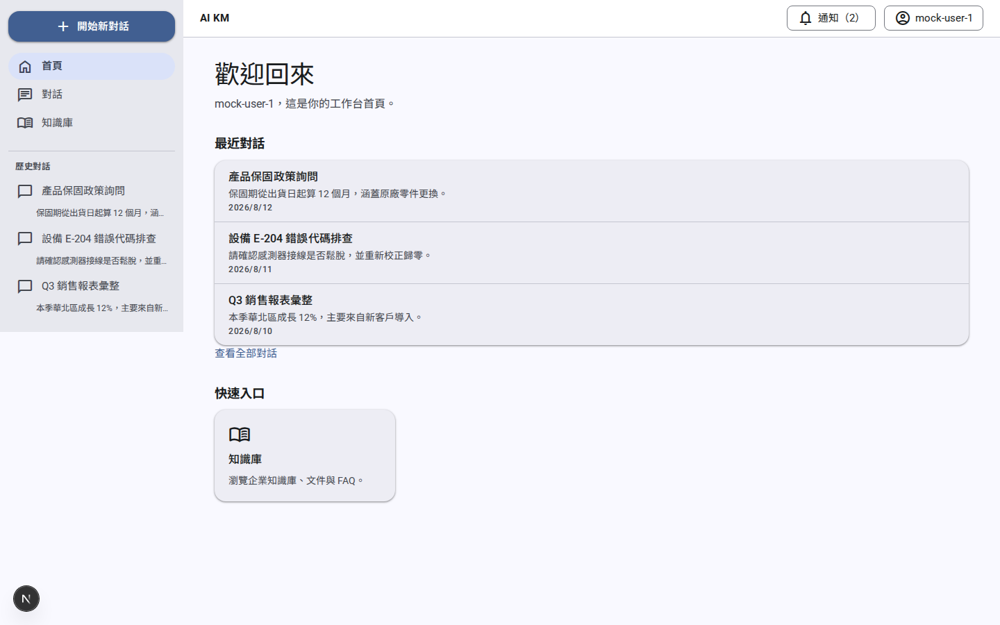
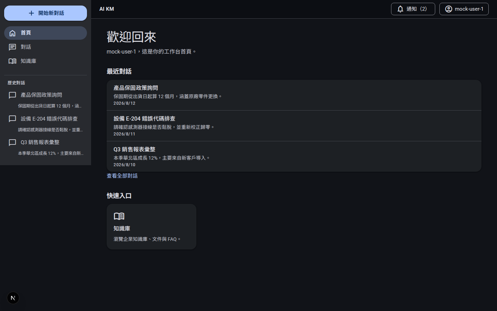
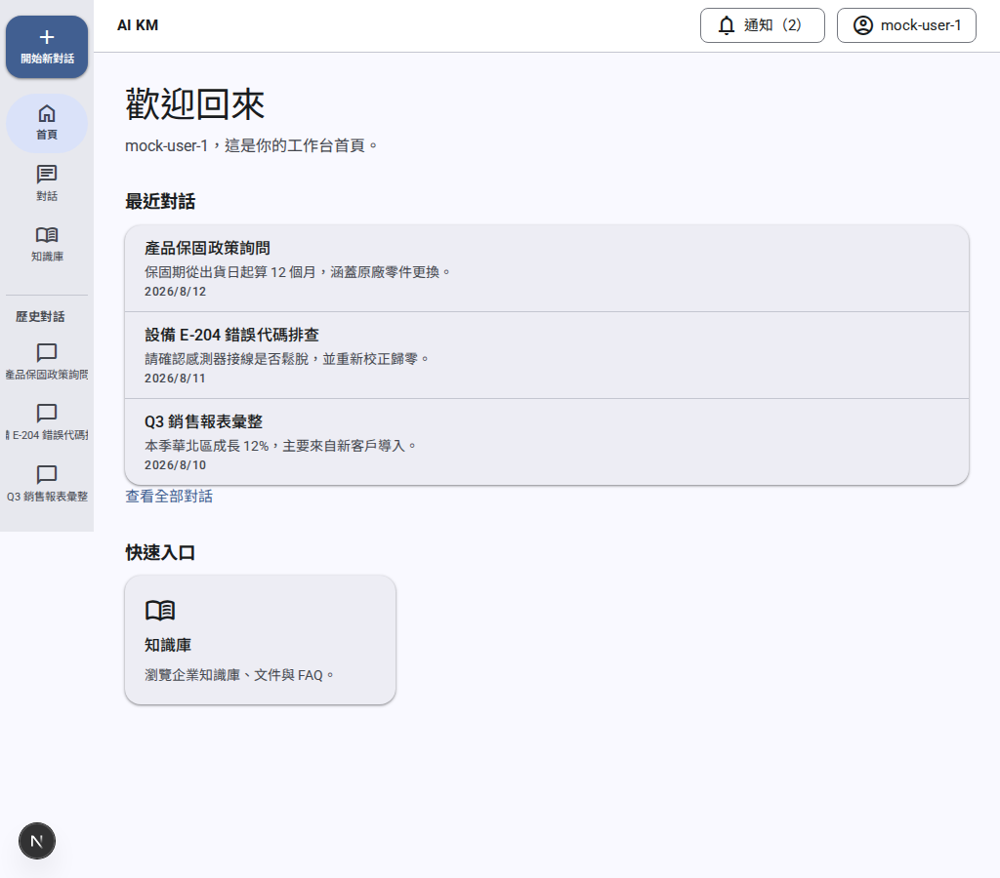
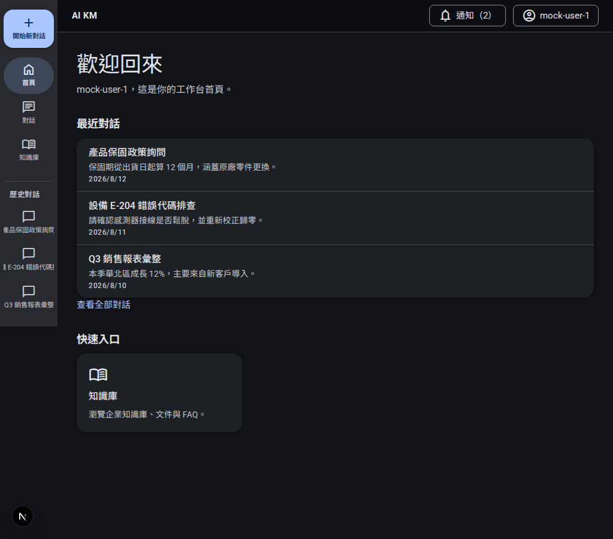
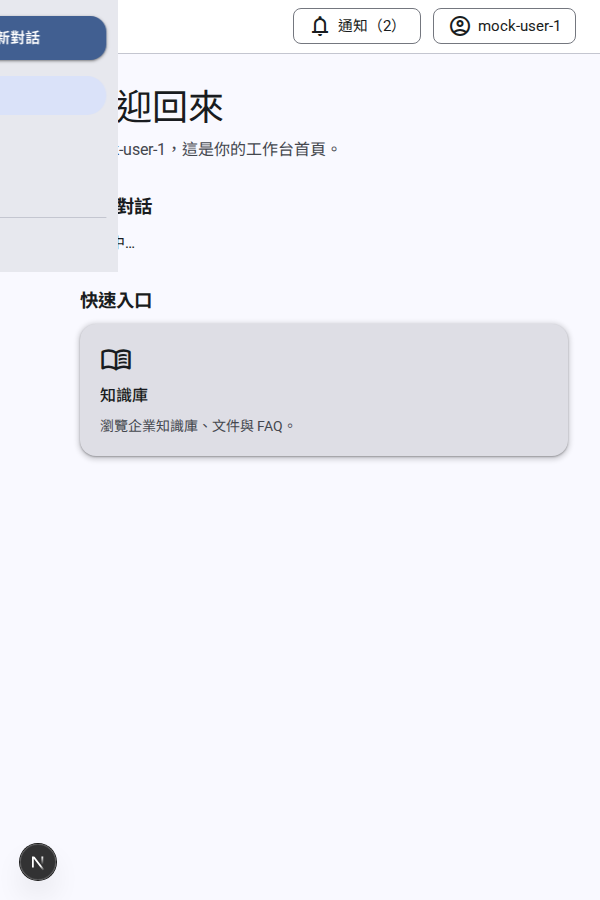
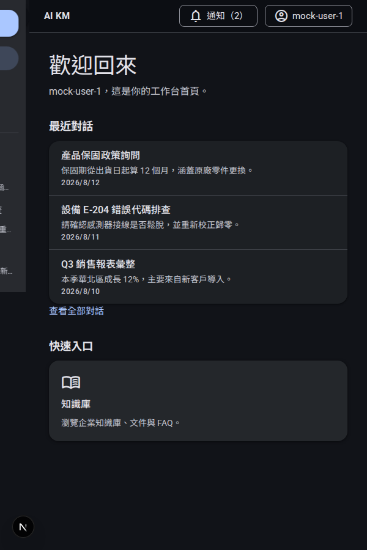

# App shell Material 3 (E01-S023)

Navigation rail/drawer/modal, M3 top app bar, extended FAB, M3 list
(history), and M3 menu treatment for `user-menu`/`notification-center` —
built on the token foundation from E01-S021 and the self-hosted
fonts/`<Icon>` from E01-S022. No DOM structure, accessible name, role, or
route changed; every affected component keeps its own existing unit tests
passing unmodified.

## Navigation modes

`apps/web/src/app/(app)/_components/app-shell.tsx` sets `data-nav-mode` on
the shell root, computed from `window.innerWidth` and re-computed on
resize:

| Width | Mode | Sidebar presentation |
|---|---|---|
| ≥ 1240px | `drawer` | Full-width, always-visible sidebar (the pre-existing layout) |
| 840–1239px | `rail` | Narrow icon-forward rail; labels shrink rather than disappear |
| < 840px | `modal` | Off-canvas panel behind a hamburger button + scrim |

`navMode` starts `undefined` and is only ever set inside a `useEffect` —
the attribute is simply absent from the server-rendered and first-paint
HTML, then added right after mount. No SSR/hydration mismatch; the
`<Sidebar>` itself is never unmounted across modes, only a wrapper class
changes, so its own tests (and everyone else's, which query the sidebar's
nav landmark) are unaffected regardless of which mode jsdom's default
viewport resolves to.

## Modal drawer (< 840px)

- A hamburger button (`aria-label="開啟導覽選單"`, `aria-expanded`) opens
  the drawer.
- Opening renders a full-screen scrim (`data-testid="app-shell-scrim"`)
  behind the sliding-in sidebar panel.
- **Esc** closes the drawer.
- Clicking the scrim closes the drawer.
- Closing (either way) returns focus to the hamburger button.

Covered by both `app-shell.test.tsx` (jsdom, mocked `window.innerWidth`)
and `tests/e2e/specs/app-shell-m3.spec.ts` (real Chromium viewport resize).

## Icons

Every nav item, the FAB, and both menu triggers/items use `@ai-km/ui`'s
`<Icon>` (Material Symbols Outlined, self-hosted per E01-S022) with no
`label` prop — the icon renders `aria-hidden`, so it never changes an
element's accessible name. This is how the FAB, sidebar links, and menu
triggers keep their exact pre-existing accessible names
(`getByRole("link", { name: "開始新對話" })` etc. all still pass unmodified).

| Nav item | Icon |
|---|---|
| 首頁 | `home` |
| 對話 | `chat` |
| 知識庫 | `menu_book` |
| 維修助手 | `build` |
| ERP 助手 | `insights` |
| 開始新對話 (FAB) | `add` |
| 歷史對話 (M3 list leading icon) | `chat_bubble` |
| 使用者選單 trigger | `account_circle` |
| 個人資料 | `person` |
| 登出 | `logout` |
| 通知中心 trigger | `notifications` |
| 漢堡選單 | `menu` |

The href → icon mapping lives inside `sidebar.tsx` itself (a local
`NAV_ICON_NAMES` map), not in `nav-items.ts` — that file is on this
story's "禁止修改" list, and the icon choice is a presentation concern of
the sidebar, not the nav-item data model.

## M3 list: history rail

Each history item is now:

```html
<li class="sidebar-history-item">
  <a class="sidebar-history-link" href="..." aria-current="...">
    <Icon name="chat_bubble" />
    <span class="sidebar-history-headline">{title}</span>
  </a>
  <p class="sidebar-history-preview">{lastMessagePreview}</p>
</li>
```

The supporting-text preview (`lastMessagePreview`, single-line truncated
via CSS) is a **sibling** of the `<a>`, not nested inside it — nesting it
would have changed the link's accessible name (title + preview
concatenated), breaking the existing
`getByRole("link", { name: "產品保固政策詢問" })`-style assertions. Kept as
a sibling: the link's accessible name stays exactly the title, and the
preview is still visually a second line via `globals.css`. Selected items
use `secondary-container`/`on-secondary-container` (via the existing
`--sidebar-active`/`--sidebar-active-text` M3 role mapping from
E01-S021 — no new color decision here).

## M3 menu (user-menu, notification-center)

Both components' dropdown panels moved off inline `style={{...}}` onto
real CSS classes (`.m3-menu-anchor`, `.m3-menu-trigger`, `.m3-menu`,
`.m3-menu-item`) so they pick up M3 elevation/shape/color tokens; the
underlying `role="menu"`/`role="dialog"`, `aria-expanded`,
`aria-haspopup`, and every button/link's text content are byte-for-byte
unchanged.

## Screenshots

Captured against a throwaway dev server (`PORT=3910`, not the shared
E2E infrastructure), logged in as the demo user, `colorScheme` context
emulation for light/dark:

| Width | Light | Dark |
|---|---|---|
| 1440 (drawer) |  |  |
| 1024 (rail) |  |  |
| 600 (modal) |  |  |

No unreadable text, no broken layout, no horizontal overflow observed at
any of the three widths in either theme.

## Accessibility

`tests/e2e/specs/app-shell-m3.spec.ts` runs `@axe-core/playwright` against
`.app-shell` on the home page and asserts zero `serious`/`critical`
violations. This actually caught a real, pre-existing `color-contrast`
failure on the first run — not a false start: `.sidebar-history-title`
("歷史對話") carried an `opacity: 0.75` dimming that dropped an otherwise
AA-passing `on-surface-variant`/`surface-container-high` pairing to 4.1:1
against the `--sidebar-bg` E01-S021 established for that region (below the
4.5:1 small-text threshold). The new `.sidebar-history-preview` text this
story adds had the same issue at `opacity: 0.7` (3.65:1). Fixed both by
removing the opacity dimming (the token pairing itself is fine at full
opacity — this repo's E01-S021 contrast report already covers it); also
removed the same dimming from `.sidebar-history .sidebar-empty`, the one
sibling state axe didn't happen to catch only because it wasn't on-screen
during the scan (a genuinely-empty history list), not because it was fine.
Re-running after the fix: 0 violations, screenshots above regenerated
against the corrected styling. Fixed once and confirmed rather than
"most likely fine" reasoning.

**Self-review follow-up**: removing the opacity from `.sidebar-history-title`
and `.sidebar-history-preview` fixed the contrast bug but had a side
effect axe can't detect — `.sidebar-history-link` (the item's title) used
the same `--sidebar-text` (on-surface-variant) token as
`.sidebar-history-preview`, so after the opacity fix the title and its
supporting-text preview rendered in the *exact same color*, leaving only
font-size to tell them apart. `/story-review`'s self-review checklist
caught this (axe only checks contrast ratios, not visual hierarchy).
Fixed by moving `.sidebar-history-link` to `--sidebar-text-strong`
(on-surface) — strictly increases contrast, so it cannot reintroduce an
axe violation (re-verified: still 0). Screenshots above are from this
corrected version.
