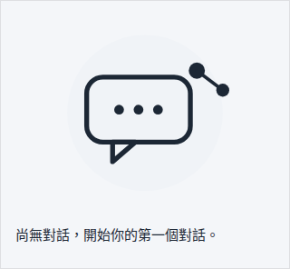
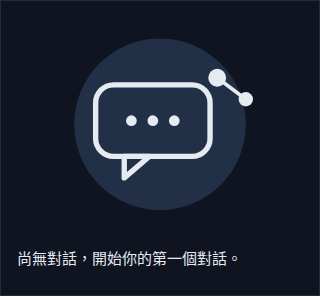
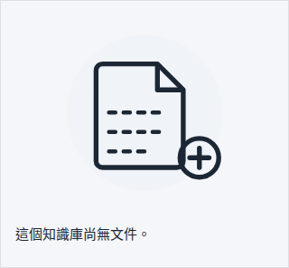
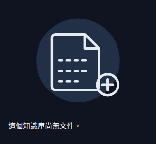
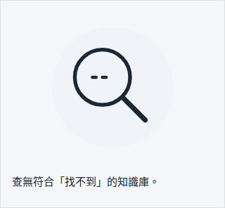
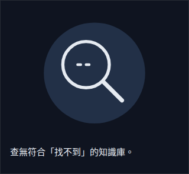

# 品牌與空狀態素材（E01-S026）

全部**原創**幾何圖形（對話氣泡 + 知識節點抽象組合），單色（`currentColor`
/ 固定品牌色二擇一，見下方各檔說明），無外部圖庫、無 Lottie（依 ADR 0006
§5），未引用或改作任何既有品牌／產品的 logo 或插圖。

## Logo mark / lockup / favicon（`apps/web/public/brand/`）

| 檔案 | 用途 | 顏色 |
|---|---|---|
| `logo-mark.svg`（48×48） | app 內品牌標記（header 等未來用途） | `currentColor`——隨文字色變化 |
| `logo-lockup.svg`（176×48） | 含「AI KM」字樣的完整 lockup | `currentColor`；文字用 `<text>`（見下方 ASSUMPTION） |
| `favicon.svg`（32×32） | 現代瀏覽器 SVG favicon 來源 | 固定品牌藍 `#1e56a0`（瀏覽器 chrome 渲染，無頁面 CSS context 可繼承 `currentColor`） |
| `favicon.ico`（32/48 雙解析度） | 傳統 `.ico` favicon | 由 `favicon.svg` 光柵化產生（`@resvg/resvg-js` + `png-to-ico`），同時複製一份到 `apps/web/src/app/favicon.ico`（Next.js App Router 慣例路徑，實際被 build 輸出、瀏覽器請求 `/favicon.ico` 時服務的就是這份） |
| `apple-touch-icon.png`（180×180） | iOS 加到主畫面圖示 | 實心白底（非透明——iOS 會把透明區域填成黑色，這是已知踩雷點，見下方「已知踩雷點」） |

`apps/web/src/app/icon.svg`：Next.js metadata icon 慣例路徑（與
`favicon.svg` 同內容），由 `next build` 自動產生 `/icon.svg` 路由（AC4
已用 `pnpm --filter web build` 的產物檢查驗證，見 `docs/stories/E01-S026.md`）。

視覺設計：氣泡實心填色（`currentColor`），中間用 `<mask>` 挖空出 3 個
連線小圓點（象徵「知識節點」）——技術上唯一實際上色的是 `currentColor`，
挖空的節點圖形只作為 mask 的 alpha 通道使用、本身不是第二種顏色,因此
仍是嚴格意義上的單色標記。

## 空狀態插圖（`apps/web/public/illustrations/empty/`）

| 檔案 | 接入元件 | 情境 |
|---|---|---|
| `no-conversations.svg` | `conversations/_components/conversation-list.tsx` | 對話清單為空（含已封存/搜尋分支——插圖為裝飾,不隨分支切換,文案才是主要訊息，見 UX Acceptance） |
| `no-documents.svg` | `knowledge/[id]/documents/_components/knowledge-document-list.tsx` | 知識庫尚無文件（含已封存分支，同上） |
| `no-results.svg` | `knowledge/_components/knowledge-list.tsx` | 知識庫搜尋無結果（該元件是 app 中唯一有獨立搜尋輸入框且明確區分「真的沒有」vs「搜尋沒命中」兩種文案的清單，見程式碼原有註解） |

**接入點選擇的理由**（ASSUMPTION，可事後調整——spec 只寫「三處接入
（對話清單／知識文件列表／搜尋無結果），各一行」，未逐字指定是哪三個
元件檔案）：`conversation-list.tsx` 與 `knowledge-list.tsx` 的空狀態
訊息文案本身已經在同一個 `EmptyState` 呼叫點依 `query.trim()` 分支（例：
「尚無對話」vs「查無符合...的對話」），但 UX Acceptance 明講插圖是
「裝飾（`aria-hidden`），文案仍為主要訊息」——所以刻意**不**額外複製
分支邏輯到插圖上（那會超出「三處接入元件各一行」的範圍），而是三個檔案
各給一個固定插圖：`conversation-list.tsx` 代表「對話清單」這個身份
（不論是否在搜尋）、`knowledge-document-list.tsx` 唯一、無搜尋分支,是
最乾淨的「no-documents」語意配對、`knowledge-list.tsx` 因為是 app 中
唯一有真正「搜尋」UI 且程式碼註解明確討論這個情境的清單,配「no-results」。

視覺設計：160×120 viewBox，`var(--md-sys-color-surface-container,
var(--surface-2, #e3e2e6)))`（見下方 token 對照）背景圓 + `currentColor`
線稿，延續品牌標記的「對話氣泡 + 知識節點」視覺語言（no-conversations
甚至直接重用同一組氣泡+節點圖形）。

- `no-conversations.svg`：對話氣泡（含「...」打字指示）+ 品牌節點連線。
- `no-documents.svg`：文件圖示（折角）+ 虛線文字列 + 右下角「+」badge。
- `no-results.svg`：放大鏡 + 虛線（象徵「找不到內容」）。

## Token 對照（fallback chain，同 `docs/design/voice-visualizer.md` 的既有做法）

背景圓的 `fill` 是三層 fallback：

```
var(--md-sys-color-surface-container, var(--surface-2, #e3e2e6))
```

1. `--md-sys-color-surface-container`：E01-S021 落地後的真正 M3 token（目前不存在，SOFT 依賴）。
2. `--surface-2`：**現在就存在**於 `apps/web/src/app/globals.css`，且已經有自己的
   `prefers-color-scheme: dark` 版本（light `#f0f3f7` / dark `#223047`）——實際上線的 fallback。
3. `#e3e2e6`：最後手段，CSS 完全未載入時的硬編字面值。

**這一層 fallback 不是理論性的，是截圖過程中抓到的真 bug**：一開始只寫了
`var(--md-sys-color-surface-container, #e3e2e6)`（單層 fallback），在
light mode 看起來沒問題，但用 Playwright 真實 Chromium 對 dark mode
（`context.colorScheme = "dark"`）截圖後發現背景圓仍是淺灰
`#e3e2e6`（因為 M3 token 還不存在，永遠 fallback 到字面值），而 dark
mode 下 `currentColor`（continer的文字色）是淺色（`--text: #e6ebf2`），
導致淺灰線稿疊在淺灰背景上、對比度幾乎消失，插圖幾乎看不見。改成上面
三層 fallback、重用 globals.css **既有**的 `--surface-2`（已經是正確的
dark-mode-aware token）後重新截圖確認修正。E01-S021 落地後，最外層
`--md-sys-color-surface-container` 一旦有定義,三個插圖與品牌標記都不需要
任何程式碼改動即可自動切換。

## Logo lockup 的字型 ASSUMPTION（spec 二擇一）

Spec：「使用 Roboto 轉外框或以 `<text>` 依賴自託管字型——二擇一記錄」。
選擇：**`<text font-family="Roboto, system-ui, sans-serif">`**，理由：
E01-S022（自託管 Roboto/Noto Sans TC）尚未落地，且沒有實際 Roboto 字型檔
可用來手動描邊轉外框（會產出不精確的近似字形，品質更差）；`<text>` 在
E01-S022 落地前會 fallback 到系統無襯線字型渲染，視覺上可接受的降級,
E01-S022 完成後 lockup 自動變成自託管 Roboto,無需改檔案。

## 截圖（AC5：三個空狀態 light/dark）

Playwright 真實 Chromium（`tests/e2e/node_modules/@playwright/test` 既有
依賴，未新增任何 package），與 E03-S040/E03-S042 同一套流程：

1. 建立一個暫時的（**不進 repo**）測試頁
   `apps/web/src/app/scratch-empty-state-verify/page.tsx`，橫向並排渲染
   三個 `EmptyState`（各帶真實文案 + 對應插圖）。
2. `next dev -p 43217`（隨機 port，避開 3000/3001，不需要 flock）。
3. `browser.newContext({ colorScheme: "light" })` 與
   `browser.newContext({ colorScheme: "dark" })`（Playwright 原生
   `prefers-color-scheme` 模擬，不是 CSS media query hack）各截 3 張。
4. 截圖存到 scratchpad，複製進 `docs/design/brand-assets/*.png`（本 story
   「允許修改清單」`docs/design/brand-assets.md（新增）`的必要延伸——
   AC5 明文要求截圖，markdown 需要可解析的圖片檔案，視為同一份新增文件
   的資產子目錄，比照 `docs/design/voice-visualizer/` 的既有先例）。
5. 過程中發現並修正上述 dark-mode 對比度 bug（見上方 token 對照一節），
   修正後重新截圖確認。
6. 測試頁刪除（從未 `git add`），`next dev` process 確認已終止、port
   43217 確認釋放，`git status` 確認乾淨才繼續。

| 情境 | light | dark |
|---|---|---|
| no-conversations |  |  |
| no-documents |  |  |
| no-results |  |  |

肉眼核對：三個情境的圖形彼此明顯不同（氣泡+節點／文件+虛線／放大鏡，不
只靠顏色區分）；dark mode 下背景圓與線稿對比度良好（修正後）；文案完整
可讀，未被任何 UI 遮擋。

## Runtime 渲染方式（為什麼有兩份檔案）

`packages/ui/src/empty-state.tsx` 的 `illustration` prop 型別是
`ReactNode`。`apps/web/next.config.ts` 沒有設定 SVGR（webpack `.svg` →
React component）loader，所以無法直接 `import` 這些 `.svg` 檔案當元件
使用。因此：

- `apps/web/public/illustrations/empty/*.svg`、`apps/web/public/brand/*`：
  靜態資產「源頭」——供 svgo lint（AC3）、瀏覽器/工具直接參照、本文件截圖
  與說明使用。
- `apps/web/src/components/illustrations/empty-state-illustrations.tsx`：
  對應的 inline JSX 版本（`NoConversationsIllustration` /
  `NoDocumentsIllustration` / `NoResultsIllustration`），實際被三個接入
  元件當 `illustration` prop 傳入時使用的就是這份。

這與 E03-S042 VoiceVisualizer 的既有作法一致（一份靜態 SVG 資產 +
一份 inline JSX 渲染，互相對應但分開維護），不是本 story 新發明的模式。
兩份內容需手動保持一致，日後若改其中一份記得同步另一份。

## 授權

原創設計，repo license（與程式碼相同）；不含任何第三方商標、字型授權
限制（Roboto 是 Apache-2.0，`<text>` 只是引用系統/自託管字型渲染，未
嵌入任何字型檔本身於 SVG 內）。

## SVG lint（AC3）

全部 7 個新增 `.svg`（`logo-mark.svg`、`logo-lockup.svg`、
`favicon.svg`、`apps/web/src/app/icon.svg`、`no-conversations.svg`、
`no-documents.svg`、`no-results.svg`）皆已用 `pnpm dlx svgo --multipass`
處理（提交的就是 svgo 輸出，非事後才跑），並確認：
- 對同一批檔案再跑一次 `svgo --multipass`，全部回報 `0%`（已是最優化
  狀態，非空話宣稱「有跑過 lint」）。
- `grep -inE "script|onload|onclick|href=\"http"` 全部無結果——無
  `<script>`、無外部 URL 參照。
- 品牌標記／lockup／空狀態插圖的線稿一律 `currentColor`；`favicon.svg`／
  `icon.svg`／`apple-touch-icon.png`／`favicon.ico` 因需在無 CSS
  context 的瀏覽器 chrome/主畫面渲染，固定使用品牌藍 `#1e56a0`（唯一的
  例外，已在上方逐檔列出理由）。

完整測試/gate 紀錄與 AC 逐條對照見 `docs/stories/E01-S026.md`。
