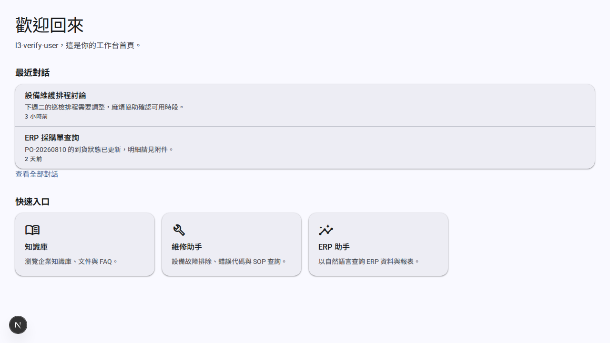
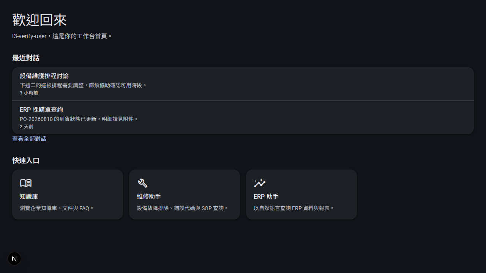
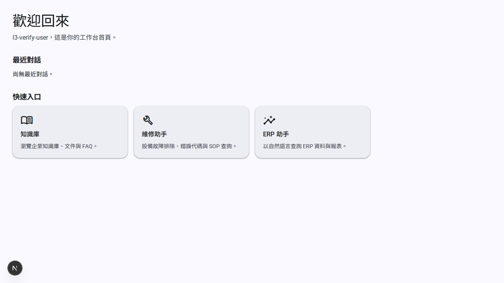
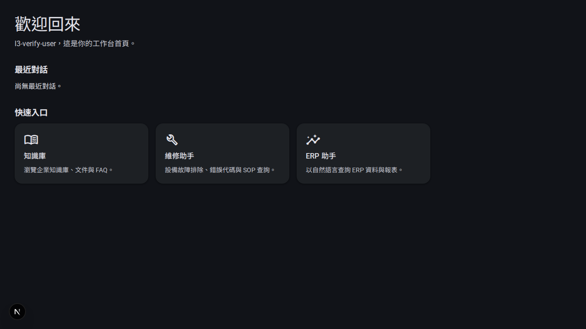
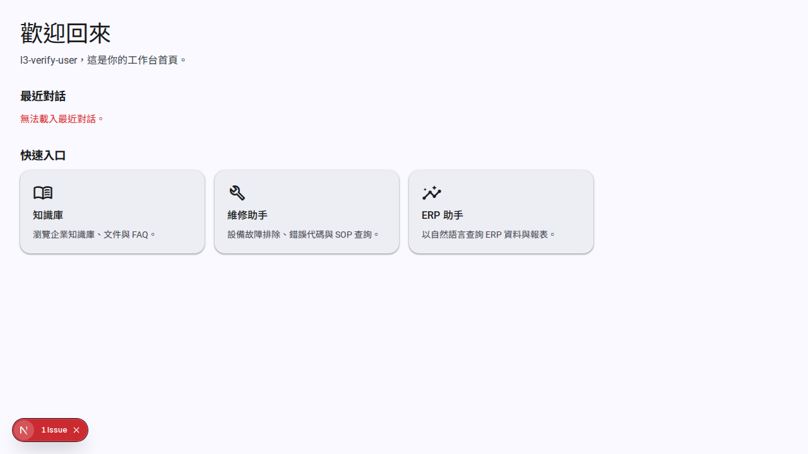
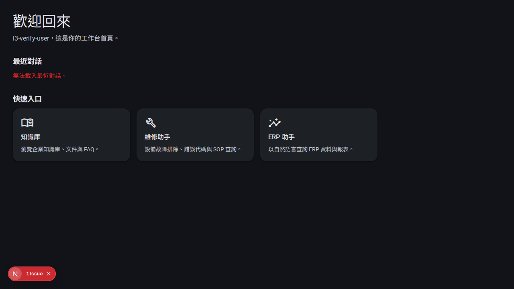
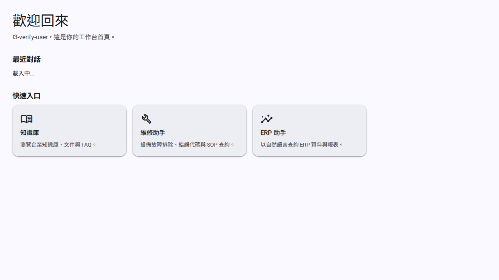
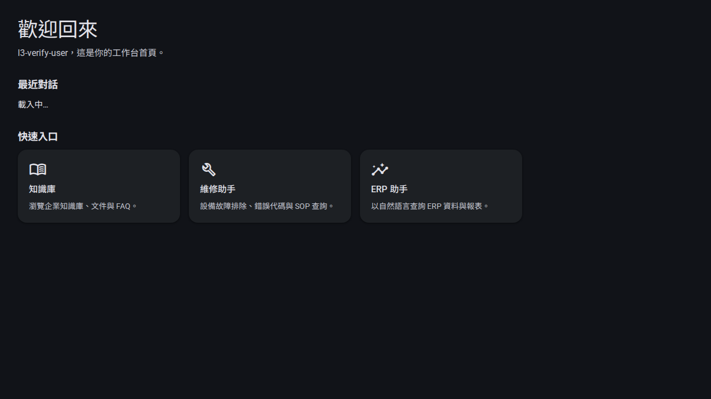

# 首頁 Material 3 Tiles（E01-S024）

`page.tsx`（歡迎區）+ `_components/quick-entry-cards.tsx`（快速入口 M3
filled card tiles）+ `_components/recent-conversations.tsx`（最近對話
M3 list tiles）。依 ADR 0006，全部改用 E01-S021 的 M3 design token
（`packages/design-tokens/src/m3-theme.css` 透過 `globals.css` 的
`@import` 引入）與 E01-S022 的 `<Icon>`（Material Symbols Outlined，
自託管字型）。CSS 集中於 `globals.css` 的 `/* ---- M3 home ---- */` 區段
（`.home-*` class）。

## 快速入口卡片（`quick-entry-cards.tsx`）

- M3 filled card：`background: var(--surface-2)`（= M3
  `surface-container`）、`border-radius: var(--radius-lg)`（=
  `--md-sys-shape-corner-large`）、`elevation level1`，hover/focus 提升
  到 `elevation level2` 並疊加 `--md-sys-state-hover-opacity`（8%）的
  state layer——與既有 `.sidebar-hover` 的 `color-mix` 手法一致，不是
  另創一套。
- 每張卡含 `<Icon>`（依 href 對照：知識庫→`menu_book`、維修→
  `build`、ERP→`insights`，對照表定義在元件內，不動 `nav-items.ts`）、
  標題（`title-medium` typescale）、說明文字（`body-medium` typescale）。
- `<a>` 包整張卡（既有結構不變）；accessible name 與 href 皆與改版前
  逐字相同（見下方測試段落）。
- 無可見卡片時仍走既有 `EmptyState` 落空狀態，不受本次改版影響。

## 最近對話（`recent-conversations.tsx`）

- M3 list tiles：整組清單放在一個 elevated 容器
  （`.home-list-tile-group`，`surface-container` 背景 + `elevation
  level1`），每筆 `.home-list-tile` 之間以 `border-top` 分隔（1px
  `var(--border)`）。
- 相對時間改用新的 `lib/format-time.ts` 的 `formatRelativeTime`
  （繁體中文，30 秒/5 分鐘/3 小時/2 天前；超過 7 天改顯示日期），取代
  原本的 `toLocaleString`。
- loading/empty/error 三態沿用既有 `LoadingIndicator`/`EmptyState`/
  `ErrorMessage`（E01-S011～S013），只是外層容器换成 M3 樣式。

## 歡迎區（`page.tsx`）

- `<h1>` 改用 `display-small` typescale（`.home-headline`），說明文字
  改用 `body-large`（`.home-supporting-text`）。
- 拿掉所有 inline `style`，全改用 `.home-*` class；`aria-labelledby`
  與標題階層（h1/h2）完全不變。

## `formatRelativeTime`（`lib/format-time.ts`，AC3）

| 輸入（距現在） | 輸出 |
|---|---|
| 5 秒前 | `5 秒前` |
| 30 秒前 | `30 秒前` |
| 5 分鐘前 | `5 分鐘前` |
| 3 小時前 | `3 小時前` |
| 2 天前 | `2 天前` |
| 剛好 7 天前 | `7 天前`（邊界內，仍是相對時間） |
| 8 天前／30 天前 | 顯示日期（`toLocaleDateString("zh-TW")`），不是「N 天前」 |

10 個測試（`format-time.test.ts`）逐一涵蓋上表 + 未來時間防禦（時鐘飄移
時夾在 `0 秒前`，不顯示負數）。

## 測試（AC1/AC2）

- `page.test.tsx`、`quick-entry-cards.test.tsx`、
  `recent-conversations.test.tsx` 既有測試**逐字未改**，全綠。
- 新增測試：
  - `quick-entry-cards.test.tsx`：三張卡的 accessible name／href 在加
    圖示後逐字不變（`toHaveAccessibleName` 精確比對，不是只靠
    regex）；每張卡的 `.md-icon` 內容對照 spec 指定的圖示名稱
    （`menu_book`/`build`/`insights`），且 `aria-hidden="true"`。
  - `recent-conversations.test.tsx`：用 `vi.setSystemTime` 固定「現在」
    時間，斷言清單真的顯示 `formatRelativeTime` 算出的「3 小時前」，
    不是原本的 locale 字串。
  - `format-time.test.ts`：見上表。

## 視覺驗收（AC4/AC5）

Playwright 真實 Chromium（`tests/e2e` 既有 `@playwright/test` 依賴，
未新增任何 package），比照 E01-S026 的既有流程：

1. 建立暫時（**不進 repo**）測試頁
   `apps/web/src/app/scratch-home-m3-verify/page.tsx`：直接掛
   `CurrentUserProvider` + 真實 `HomePage`，並用專案既有的測試逃生艙
   `setApiFetchForTests`（`apps/web/src/lib/api.ts`，`E03-S036` 為單元
   測試新增，本 story 借用於**這個暫時視覺驗證頁**，非正式程式碼路徑）
   依 `?state=` query 參數擬出 loaded／empty／error／loading 四態，讓
   `RecentConversations` 在沒有真實後端時也能擺出每一種畫面。
   - **除錯過程記錄**：第一版嘗試用 `useEffect` 覆寫 `window.fetch`，
     結果「loaded」畫面卻顯示錯誤訊息——因為 `@ai-km/api-client` 的
     `createApiClient` 在 module 載入當下就把 `fetch` 綁定捕捉起來，
     component mount 後才覆寫 `window.fetch` 早已來不及生效。改用專案
     既有的 `setApiFetchForTests`（在 module top-level、HomePage 開始
     render 之前同步呼叫）後才正確顯示各態,已重新截圖確認。
2. `next dev -p 47281`（隨機 port,不需要 flock）。
3. `browser.newContext({ colorScheme: "light"/"dark" })` 對 loaded/
   empty/error 三態各截一張(dark 額外再截 loading 一張,共 8 張)。
4. Light mode 額外注入 `axe-core`(`pnpm add axe-core` 於 repo 外的
   scratch 專案,未動任何 repo package.json)`.run()`,三態(loaded/
   empty/error)各檢查一次:**0 violations(含 0 serious/critical)**,
   非只檢查其中一態。
5. 測試頁與腳本用完即刪(從未 `git add`),`next dev` process 與 port
   47281 確認釋放,`git status` 確認乾淨才繼續。

| 狀態 | light | dark |
|---|---|---|
| loaded(2 筆對話) |  |  |
| empty |  |  |
| error |  |  |
| loading |  |  |

肉眼核對:四態彼此明顯不同(不只靠顏色——loading 顯示「載入中…」文字、
empty 顯示「尚無最近對話。」、error 顯示紅色「無法載入最近對話。」、
loaded 顯示真實清單);快速入口卡片的 hover/focus elevation 與 state
layer 在兩種色彩模式下對比度皆良好;文案完整可讀,未被任何元素遮擋。

## Token 對照（fallback 說明）

本 story 開工時 E01-S021/E01-S022 皆已在 main 上(`in-progress`,AC4
待統一驗證,但能力本身可用),`globals.css` 的 `--md-sys-color-*`/
`--md-sys-typescale-*`/`--md-sys-shape-*`/`--md-sys-elevation-*`/
`--md-sys-state-*` 全部是真實 token,不需要額外 fallback(不像
E01-S026 開工時 E01-S021 還是 todo 而需要三層 fallback)。

## 授權
不涉及第三方素材;M3 token 值本身來自 Material Design 3 開放規範公式
（`packages/design-tokens` 的既有實作,非本 story 產出)。

完整測試/gate 紀錄與 AC 逐條對照見 `docs/stories/E01-S024.md`。
