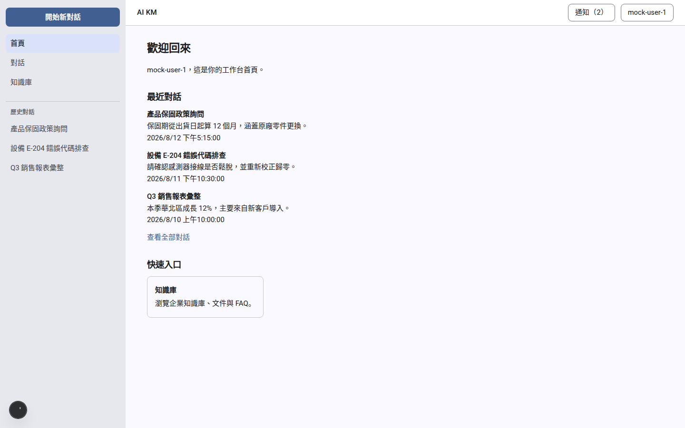
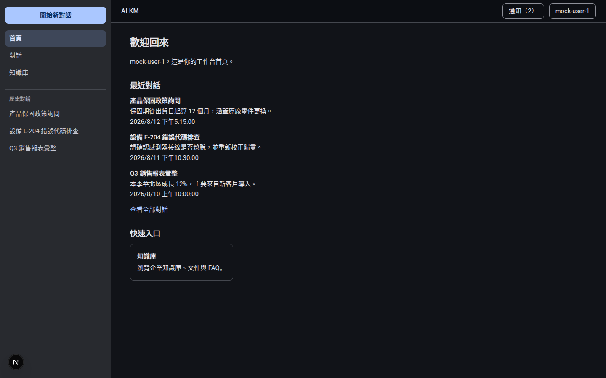
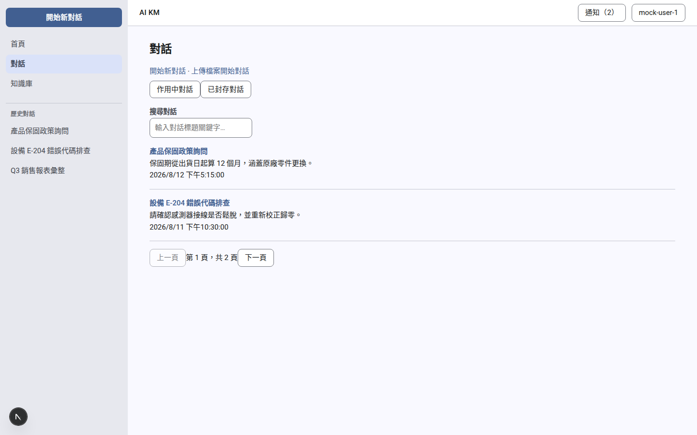
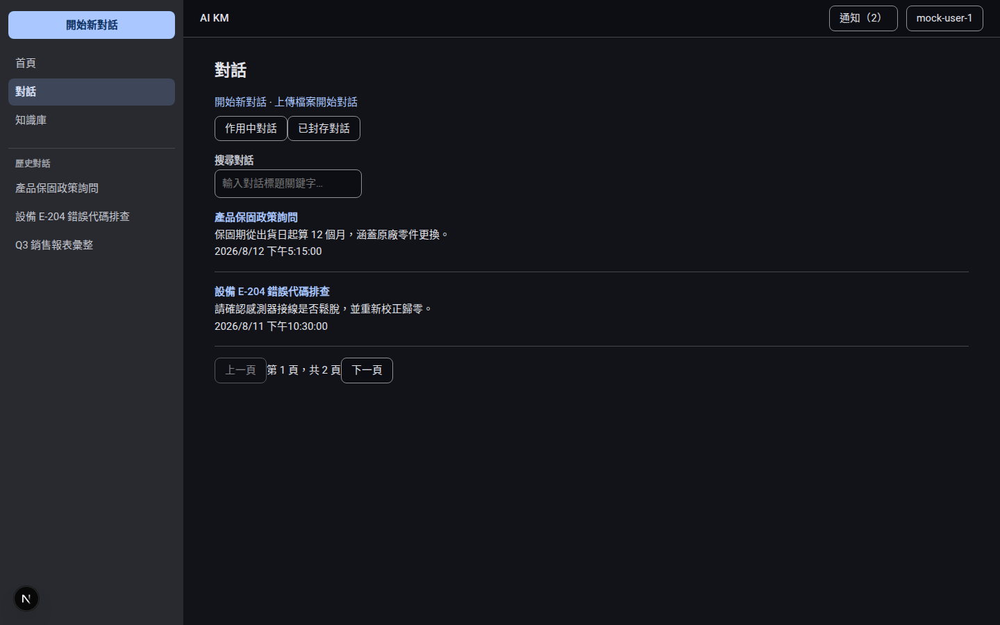
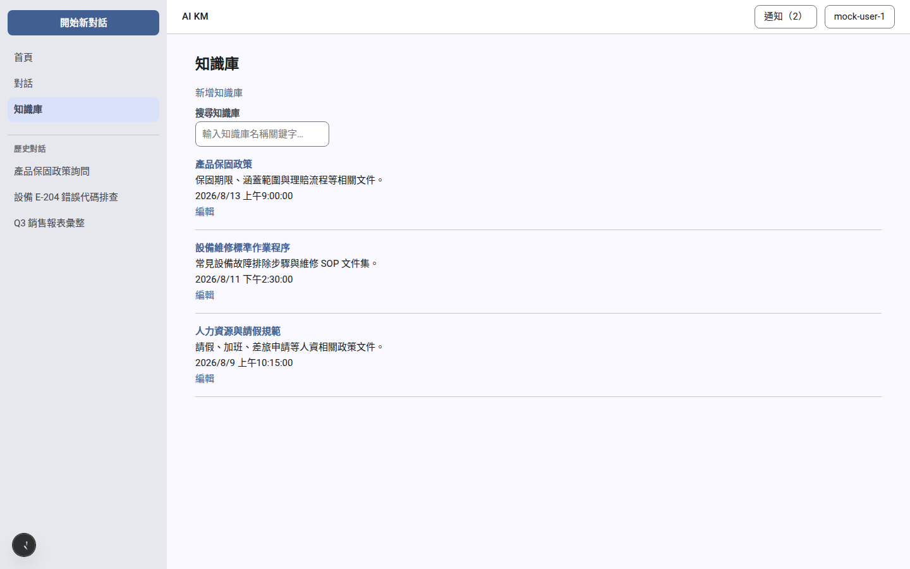
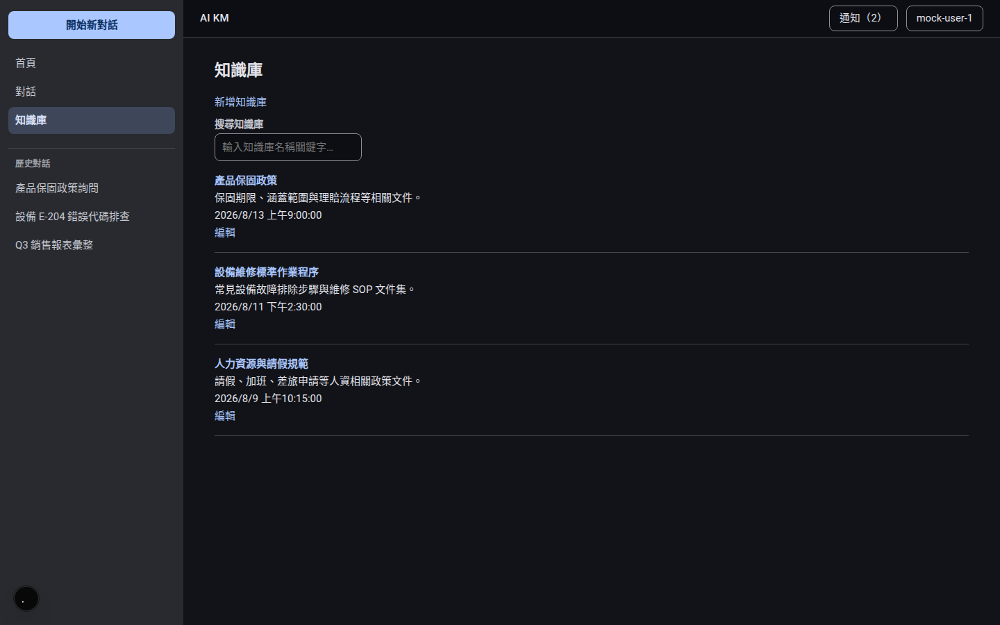
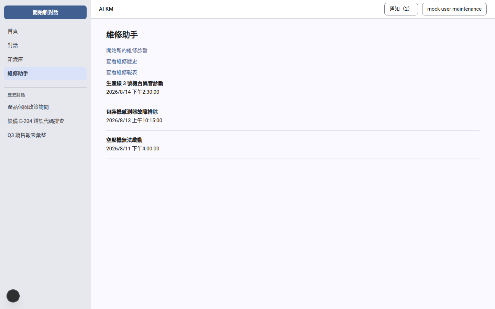
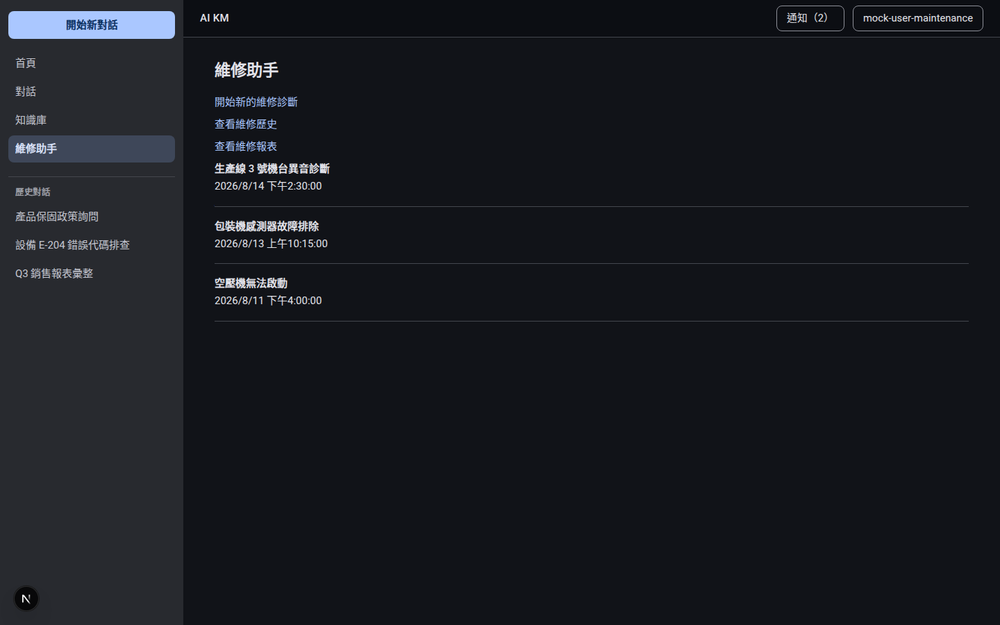
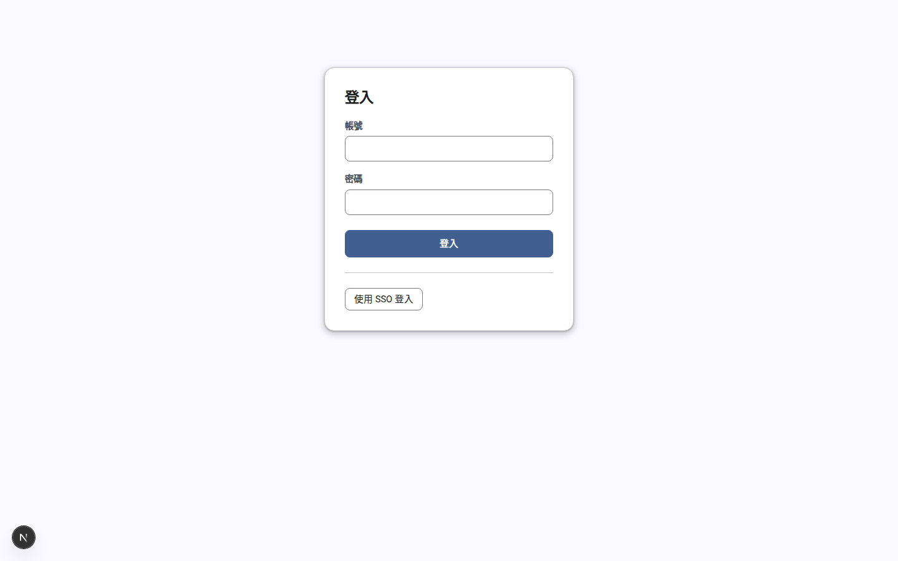
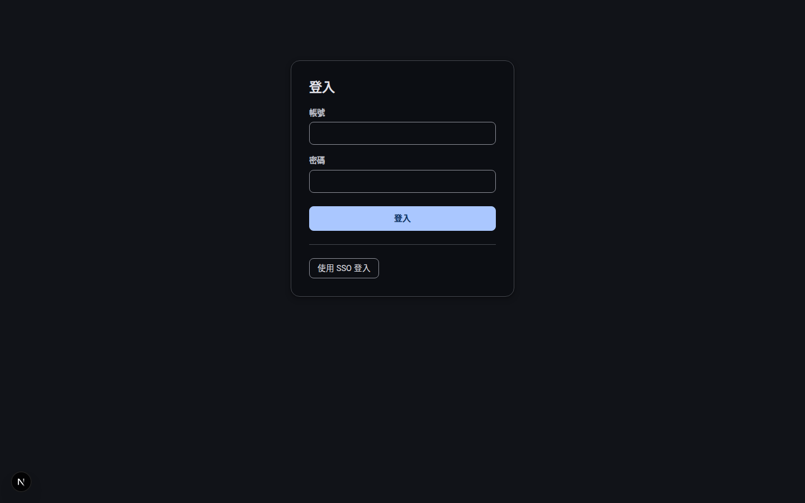

# M3 design tokens (E01-S021)

Material 3 design-token foundation: light/dark color schemes, type scale,
shape, elevation, state-layer opacities, and motion — generated from a
single seed color and consumed by `apps/web/src/app/globals.css`. This is
the base every later M3 UI story (E01-S023/S024/S025, E03-S042/S043)
builds on; it changes no component DOM.

- Source of truth for colors: `packages/design-tokens/scripts/generate-m3-theme.ts`
  → `packages/design-tokens/src/m3-theme.css` (committed).
- Source of truth for type scale / shape / elevation / state layer / motion:
  `packages/design-tokens/src/m3.ts` (TS values), mirrored by hand into
  `apps/web/src/app/globals.css` as `--md-sys-*` CSS variables — a test
  (`apps/web/src/app/globals-m3-tokens.test.ts`) cross-checks the two never
  drift apart.

## Seed color

**`#1e56a0`** (existing brand blue) — **confirmed by the user 2026-08-28**
(see `docs/stories/PENDING_DECISIONS.md`), no longer an assumption.

## How to change the seed color (< 5 minutes)

1. Edit `SEED_COLOR` in `packages/design-tokens/scripts/generate-m3-theme.ts`.
2. Run `pnpm --filter @ai-km/design-tokens generate` — rewrites
   `src/m3-theme.css`.
3. Run `pnpm --filter @ai-km/design-tokens test` — re-verifies every
   on-X/X pair still clears WCAG AA (≥ 4.5:1) for the new seed, in both
   light and dark.
4. Run `pnpm --filter @ai-km/design-tokens check` — fails the build if
   `m3-theme.css` and a fresh generation ever diverge (drift guard).
5. Commit the regenerated `m3-theme.css`.

No other file changes — everything downstream (`globals.css`, and any
future component using `var(--md-sys-color-*)`) picks up the new palette
automatically.

## Scheme generation

- Library: `@material/material-color-utilities` v0.4.0 (devDependency of
  `packages/design-tokens`; generation runs at authoring/build time only —
  zero runtime dependency, no network access).
- Algorithm: `SchemeTonalSpot`, design-spec version `2021`, `contrastLevel: 0`
  (standard, not the 2025 expressive/fixed-role variant — out of scope for
  this story).
- **Note**: `@material/material-color-utilities@0.4.0` ships nine
  `scheme_*.js` files with a missing `.js` extension on one relative
  import (`../dynamiccolor/dynamic_scheme`), which breaks under strict
  Node/Vite ESM resolution. Patched via `pnpm patch` —
  `patches/@material__material-color-utilities@0.4.0.patch`, registered in
  `pnpm-workspace.yaml`. Upstream bug, not a local workaround of our own
  logic; see EVIDENCE for detail.

## Color roles (light / dark)

All 37 M3 baseline roles (`--md-sys-color-<role>`), generated for both
schemes:

| Role | Light | Dark |
|---|---|---|
| primary | `#415f91` | `#aac7ff` |
| on-primary | `#ffffff` | `#0a305f` |
| primary-container | `#d6e3ff` | `#274777` |
| on-primary-container | `#274777` | `#d6e3ff` |
| secondary | `#565f71` | `#bec6dc` |
| on-secondary | `#ffffff` | `#283141` |
| secondary-container | `#dae2f9` | `#3e4759` |
| on-secondary-container | `#3e4759` | `#dae2f9` |
| tertiary | `#705575` | `#dcbce0` |
| on-tertiary | `#ffffff` | `#3f2844` |
| tertiary-container | `#fad8fd` | `#573e5c` |
| on-tertiary-container | `#573e5c` | `#fad8fd` |
| error | `#ba1a1a` | `#ffb4ab` |
| on-error | `#ffffff` | `#690005` |
| error-container | `#ffdad6` | `#93000a` |
| on-error-container | `#93000a` | `#ffdad6` |
| background | `#f9f9ff` | `#111318` |
| on-background | `#191c20` | `#e2e2e9` |
| surface | `#f9f9ff` | `#111318` |
| on-surface | `#191c20` | `#e2e2e9` |
| surface-variant | `#e0e2ec` | `#44474e` |
| on-surface-variant | `#44474e` | `#c4c6d0` |
| surface-dim | `#d9d9e0` | `#111318` |
| surface-bright | `#f9f9ff` | `#37393e` |
| surface-container-lowest | `#ffffff` | `#0c0e13` |
| surface-container-low | `#f3f3fa` | `#191c20` |
| surface-container | `#ededf4` | `#1d2024` |
| surface-container-high | `#e7e8ee` | `#282a2f` |
| surface-container-highest | `#e2e2e9` | `#33353a` |
| outline | `#74777f` | `#8e9099` |
| outline-variant | `#c4c6d0` | `#44474e` |
| shadow | `#000000` | `#000000` |
| scrim | `#000000` | `#000000` |
| inverse-surface | `#2e3036` | `#e2e2e9` |
| inverse-on-surface | `#f0f0f7` | `#2e3036` |
| inverse-primary | `#aac7ff` | `#415f91` |
| surface-tint | `#415f91` | `#aac7ff` |

## Contrast report (Functional AC 2 — WCAG AA, small text ≥ 4.5:1)

Computed by `packages/design-tokens/src/contrast.ts` (standalone WCAG 2.x
relative-luminance formula, independently implemented — not delegated to
the color library) and asserted in
`packages/design-tokens/scripts/generate-m3-theme.test.ts`:

| Pair | Light | Dark |
|---|---|---|
| on-primary / primary | 6.42 | 7.70 |
| on-primary-container / primary-container | 7.23 | 7.23 |
| on-secondary / secondary | 6.42 | 7.66 |
| on-secondary-container / secondary-container | 7.21 | 7.21 |
| on-tertiary / tertiary | 6.47 | 7.70 |
| on-tertiary-container / tertiary-container | 7.25 | 7.25 |
| on-error / error | 6.46 | 7.72 |
| on-error-container / error-container | 7.24 | 7.24 |
| on-surface / surface | 16.30 | 14.41 |
| on-surface-variant / surface-variant | 7.20 | 5.47 |

All 10 pairs clear 4.5:1 in both schemes (worst case: dark
on-surface-variant/surface-variant at 5.47).

## Type scale, shape, elevation, state layer, motion

TS values: `packages/design-tokens/src/m3.ts` (`typescale`, `shape`,
`elevation`, `stateLayer`, `motion`). CSS variables:
`apps/web/src/app/globals.css` (`--md-sys-typescale-*`,
`--md-sys-shape-corner-*`, `--md-sys-elevation-level*`,
`--md-sys-state-*-opacity`, `--md-sys-motion-*`) — kept identical to the TS
values by `apps/web/src/app/globals-m3-tokens.test.ts`.

- **Type scale**: the 15 standard M3 styles (display/headline/title/body/label
  × large/medium/small), each with `font-size`/`line-height`/`font-weight`/
  `letter-spacing`. Font *family* is still the pre-existing system fallback
  stack (`-apple-system, BlinkMacSystemFont, "Segoe UI", Roboto, "Noto Sans TC",
  sans-serif`) — E01-S022 swaps in self-hosted Noto Sans TC + Roboto.
  `body`'s `font-family` now reads `var(--md-sys-typescale-body-large-font)`;
  its `font-size`/`line-height` are unchanged (15px / 1.65) per this story's
  scope (spec calls out the font stack only, not resizing running text).
- **Shape**: `none` 0px, `extra-small` 4px, `small` 8px, `medium` 12px,
  `large` 16px, `extra-large` 28px, `full` 9999px. The legacy
  `--radius-sm/md/lg` variables now alias `small`/`medium`/`large`
  respectively (was 6/10/14px — a ~2px increase, within the "no broken
  layout" visual-check bar).
- **Elevation**: levels 0–5, standard M3 two-shadow `box-shadow` values.
  Legacy `--shadow-sm`/`--shadow-md` now alias levels 1/3.
- **State layer**: hover 0.08, focus 0.10, pressed 0.10, dragged 0.16 (per
  spec, verbatim). Applied via `color-mix(in srgb, <base-color> <100-opacity>%,
  <overlay-color> <opacity>%)` on the legacy `--primary-hover`,
  `--primary-active`, and `--sidebar-hover` variables — not a new `::after`
  layer, so no DOM/selector changes.
- **Motion**: `easing.standard` `cubic-bezier(0.2, 0, 0, 1)`,
  `easing.emphasized` `cubic-bezier(0.3, 0, 0.8, 0.15)`,
  `duration.short/medium/long` 150/300/500ms. This is a 3-tier
  simplification of the official M3 short1-4/medium1-4/long1-4 scale
  (picking the short2/medium2/long2-equivalent midpoints) — no story
  currently consumes per-tier duration, so the fuller scale is deferred
  until a consumer needs it.

## Legacy variable → M3 role mapping

`apps/web/src/app/globals.css`'s pre-existing variables (`--bg`,
`--surface`, `--primary`, `--sidebar-*`, ...) are now `var(--md-sys-color-*)`
aliases, not literal colors — a CSS custom property alias re-resolves
automatically when `--md-sys-color-*` flips under
`prefers-color-scheme: dark`, so `globals.css` no longer needs a
duplicate dark-mode color block (only `color-scheme: dark;` remains there).

| Legacy variable | M3 role |
|---|---|
| `--bg` | `surface` |
| `--surface` | `surface-container-lowest` |
| `--surface-2` | `surface-container` |
| `--text` | `on-surface` |
| `--text-muted` | `on-surface-variant` |
| `--border` | `outline-variant` |
| `--border-strong` | `outline` |
| `--primary` | `primary` |
| `--primary-hover` | `primary` + `on-primary` state layer (hover, .08) via `color-mix` |
| `--primary-active` | `primary` + `on-primary` state layer (pressed, .10) via `color-mix` |
| `--primary-soft` | `primary-container` |
| `--on-primary` | `on-primary` |
| `--danger` | `error` |
| `--danger-soft` | `error-container` |
| `--success` | `tertiary` (M3 baseline has no semantic "success" role; tertiary is the reused accent) |
| `--sidebar-bg` | `surface-container-high` |
| `--sidebar-text` | `on-surface-variant` |
| `--sidebar-text-strong` | `on-surface` |
| `--sidebar-hover` | `on-surface` state layer (hover, .08) via `color-mix` |
| `--sidebar-active` | `secondary-container` |
| `--sidebar-active-text` | `on-secondary-container` (new — the active-state text color, so the active sidebar item uses M3's own guaranteed-contrast pairing rather than reusing `--sidebar-text-strong` against a container it wasn't designed to pair with) |
| `--sidebar-border` | `outline-variant` |
| `--ring` | `primary` at ~45% via `color-mix` (was `rgba(30, 86, 160, 0.45)`) |
| `--shadow-sm` / `--shadow-md` | elevation level 1 / level 3 |
| `--radius-sm/md/lg` | shape `small`/`medium`/`large` |

`.sidebar-new-chat`'s previously-hardcoded `color: #ffffff` is now
`color: var(--on-primary)` — the only non-`:root` hardcoded hex found in
the file (everything else already routed through variables).

## Manual visual check (Functional AC 5)

5 representative pages, light + dark, captured against the dev server with
Playwright (`colorScheme: 'light' | 'dark'` context emulation), logged in
as the demo user where the route requires it:

| Page | Light | Dark |
|---|---|---|
| 首頁 (home) |  |  |
| 對話 (conversations) |  |  |
| 知識庫 (knowledge) |  |  |
| 維修助手 (maintenance) |  |  |
| 登入 (login) |  |  |

Captured 2026-08-28 against the dev server, logged in as the demo user
(general_user role for home/conversations/knowledge, maintenance_engineer
role for maintenance — that nav item is role-gated), 1440×900 viewport.

No unreadable text (all on-X/X pairs ≥ 4.5:1, see contrast report above)
or broken layout observed at 1440×900.

## `prefers-color-scheme: dark` switching (Functional AC 6)

Verified two ways:

1. **Computed**: `generate-m3-theme.test.ts` asserts every M3 color role
   (except `shadow`/`scrim`, which are black in both schemes by M3
   baseline design) resolves to a different hex value between
   `getSchemeHexMap(false)` and `getSchemeHexMap(true)`.
2. **Rendered**: the screenshots above, captured with Playwright's
   `colorScheme` context emulation (the same mechanism `prefers-color-scheme`
   media-query matching uses in a real browser).
