# Remaining pages — Material 3 (E01-S025)

Light/dark screenshots for the six pages this story restyled:
knowledge list, knowledge documents, maintenance home, ERP home, ERP
detail (data table), profile, login. Captured with a real Chromium via
Playwright (`colorScheme: "light" | "dark"`), not simulated.

| Page | Light | Dark |
|---|---|---|
| Knowledge list (outlined card grid) | 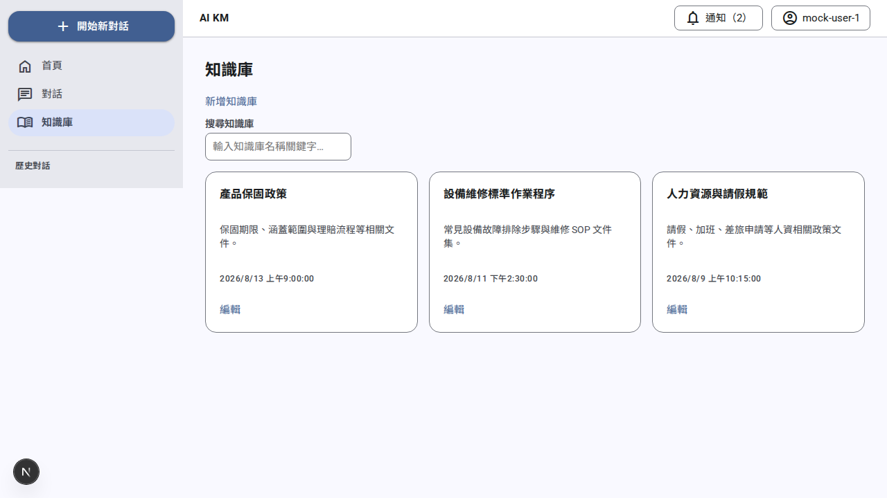 | 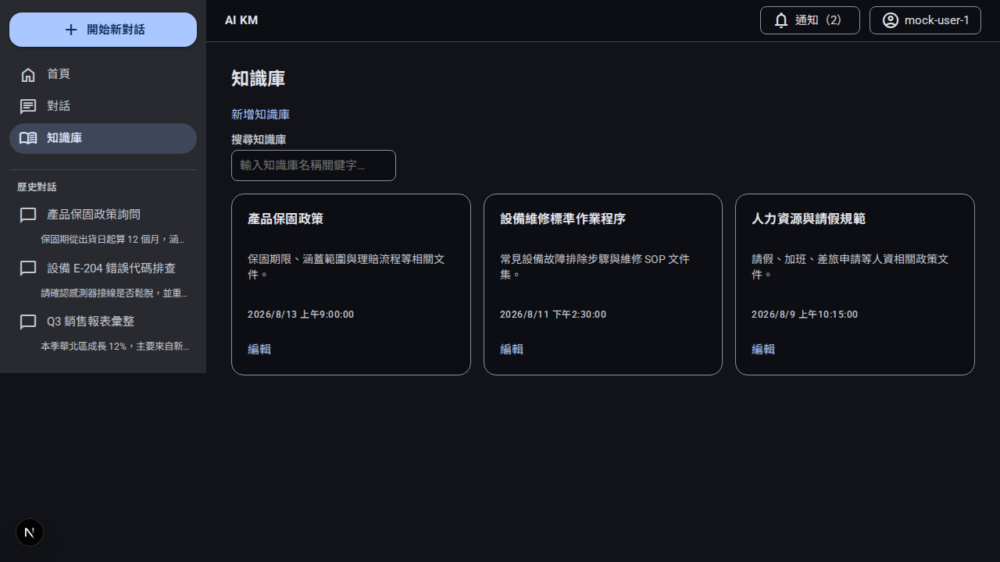 |
| Knowledge documents (list tiles + assist chip) | 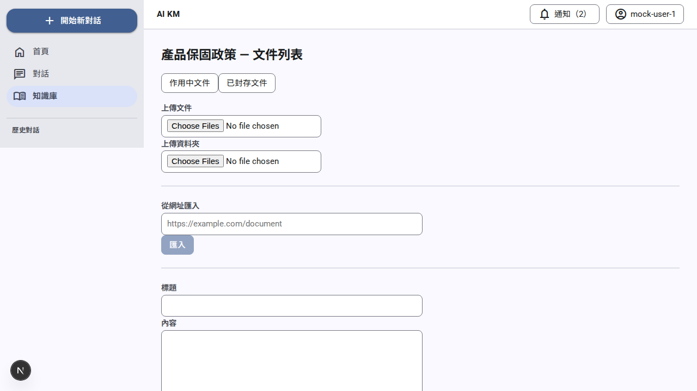 | 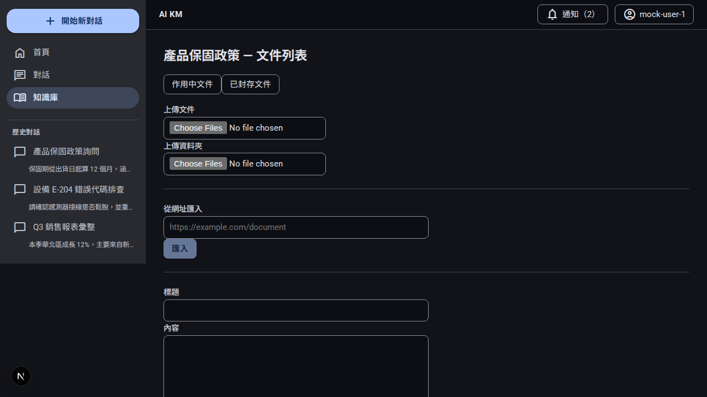 |
| Maintenance home (list tiles) | 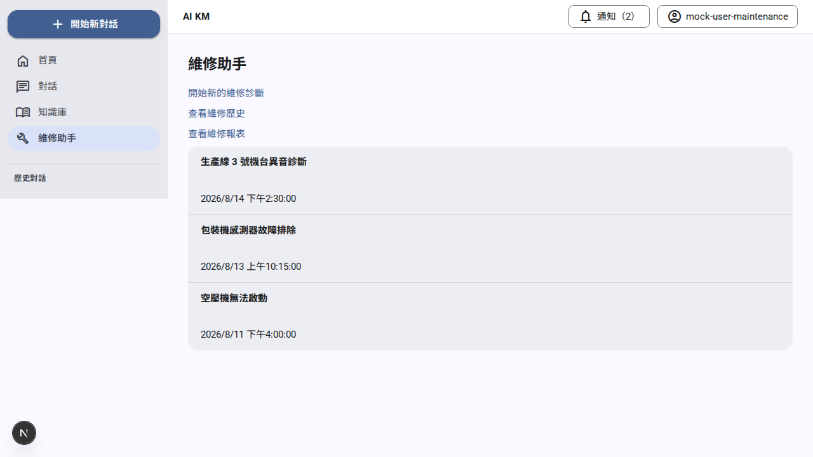 | 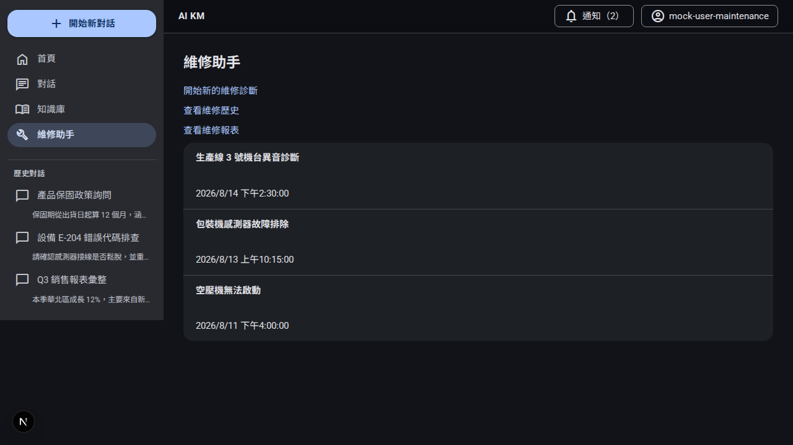 |
| ERP home (list tiles) | 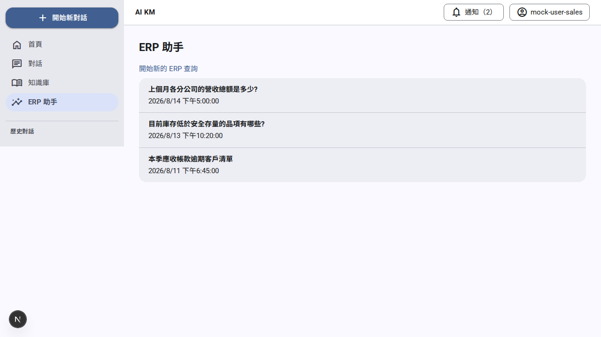 | 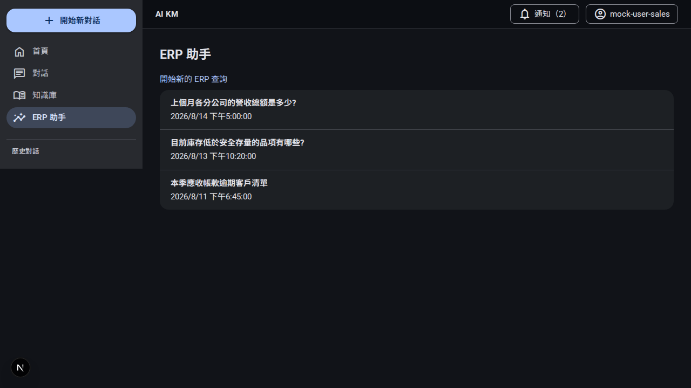 |
| ERP detail (M3 data table) | 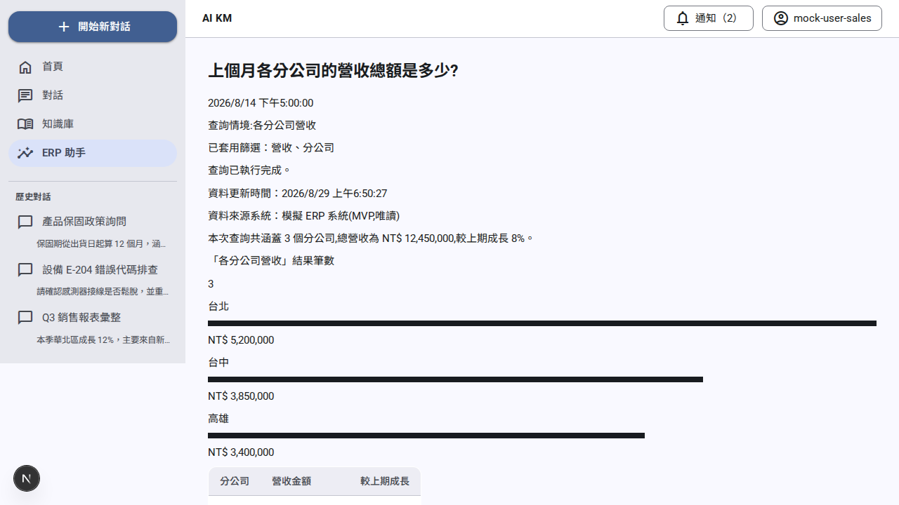 | 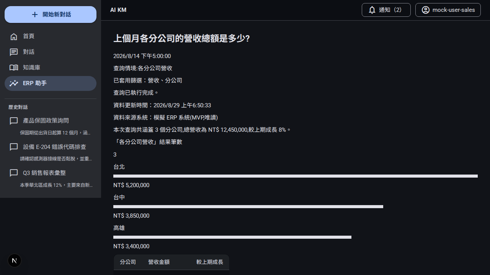 |
| Profile (M3 key/value list) | 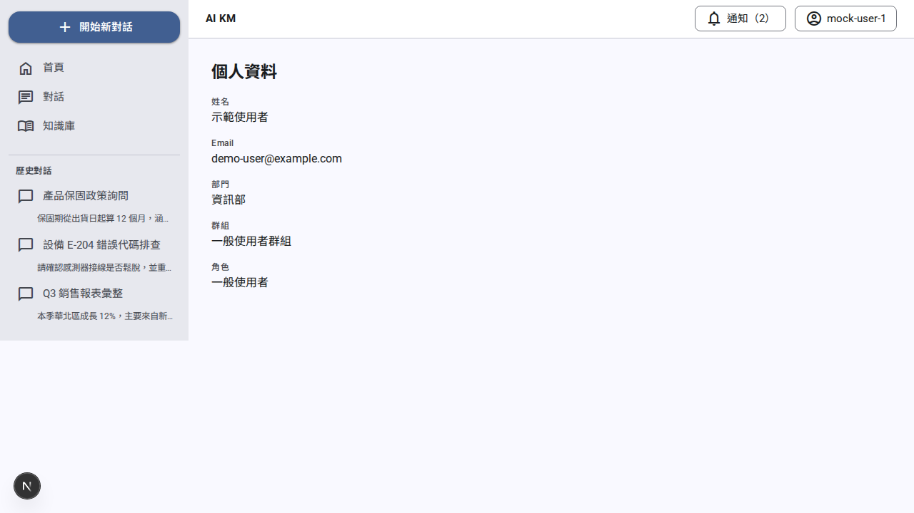 | 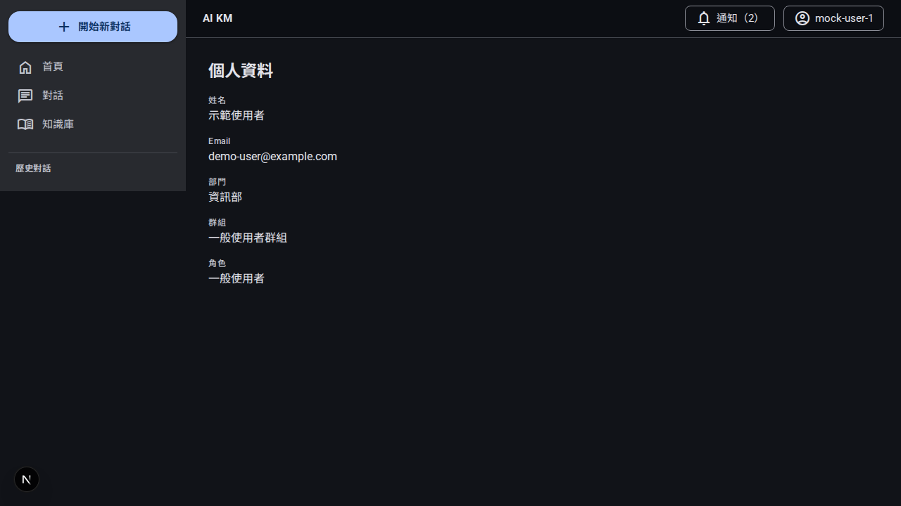 |
| Login (outlined SSO button) | 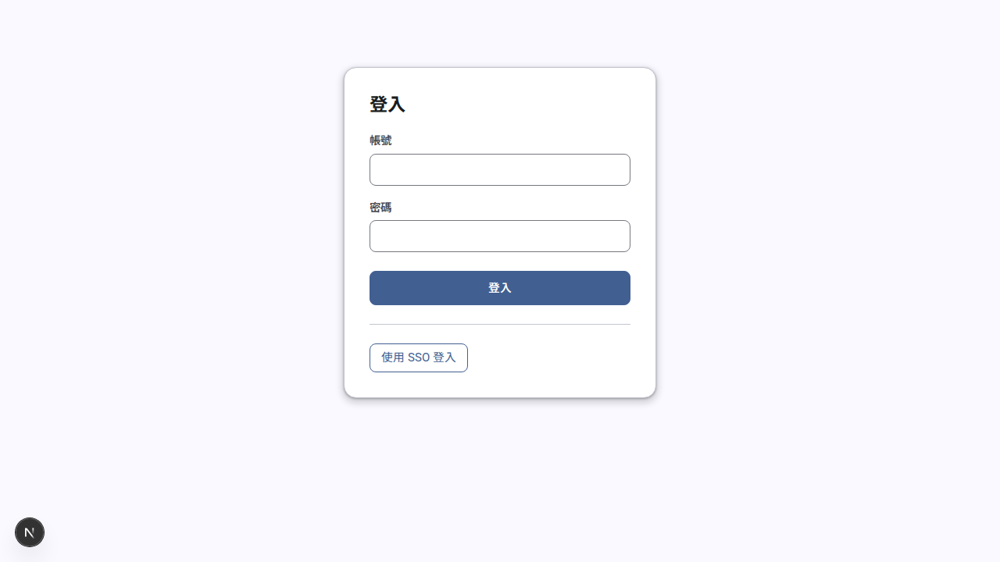 | 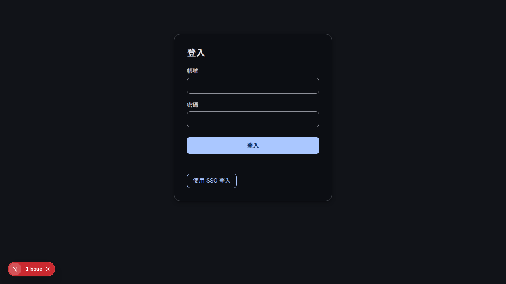 |

## What changed, per page

- **Knowledge list**: `<ul>/<li>` restyled as an outlined card grid
  (`.m3-card-grid`/`.m3-card`) — border only, no fill/shadow at rest,
  matching spec's "outlined card grid" (distinct from the home page's
  filled/elevated tiles, E01-S024).
- **Knowledge documents**: list restyled as M3 list tiles
  (`.m3-list`/`.m3-list-item`); the `role="alert"`/`role="status"`
  處理失敗/已封存 indicators (E05-S020/S029) get the new
  `.m3-assist-chip` treatment — an outlined pill, color communicated via
  border+text token pairing, never color alone (the text itself still
  carries the meaning). Both `role="alertdialog"` confirm panels
  (delete/bulk-delete) get `.m3-dialog` — elevation + shape only, no
  change to their focus-lock behavior.
- **Maintenance home / ERP home**: same `.m3-list`/`.m3-list-item`
  pattern as knowledge documents — list tiles, plain text on maintenance
  (case list has never linked items, unrelated to this story), the whole
  tile a link on ERP.
- **ERP detail**: the one real `<table>` element in the entire app
  (confirmed by a repo-wide grep) gets M3 data-table styling directly at
  the element level (row-divider-only borders, shaded header, hover state
  via `color-mix()` never `opacity`) plus `<th scope="col">` (AC3 says
  "preserve the existing scope" — there wasn't one; added since it's the
  accessibility semantics the AC is actually protecting) and a
  `.m3-table-wrapper` horizontal-scroll wrapper for narrow viewports.
- **Profile**: `<dl>` → `.m3-kv-list` — M3 typescale for the key
  (label-medium, muted) / value (body-large) pairing.
- **Login**: `.login-card` was already M3-compliant shape/elevation
  (`--radius-lg`/`--shadow-md` alias to `--md-sys-shape-corner-large`/
  `--md-sys-elevation-level3` since E01-S021). The main submit button was
  already M3's filled-button look in effect. Only the SSO button changed
  — `.m3-button-outlined` (transparent background, primary border/text).

## Why the bare `button`/`input`/`select`/`textarea`/`dl`/`fieldset`
## element rules were NOT touched

A repo-wide grep during this story's investigation confirmed all of
those are also used on the chat page and citation views — E03-S043's
scope, explicitly Out for E01-S025. Restyling them at the bare-element
level (the approach spec's technical decision describes as the default
lever) would have leaked onto the excluded chat page. Every change in
this story is therefore either a new, page-scoped class (`.m3-*`) or,
for `<table>`, a direct element-level change verified to have exactly
one consumer app-wide. See `docs/stories/E01-S025.md` for the full
reasoning.

## Axe

`tests/e2e/specs/pages-m3-axe.spec.ts` — 7/7 passed, zero
serious/critical violations, using the same `impact` threshold
`app-shell-m3.spec.ts` (E01-S023) established. Covers every new pattern
above, including actually producing a `已封存` assist chip via the real
archive-toggle button (not just asserting on an unstyled row) so its own
color contrast is genuinely under test.
